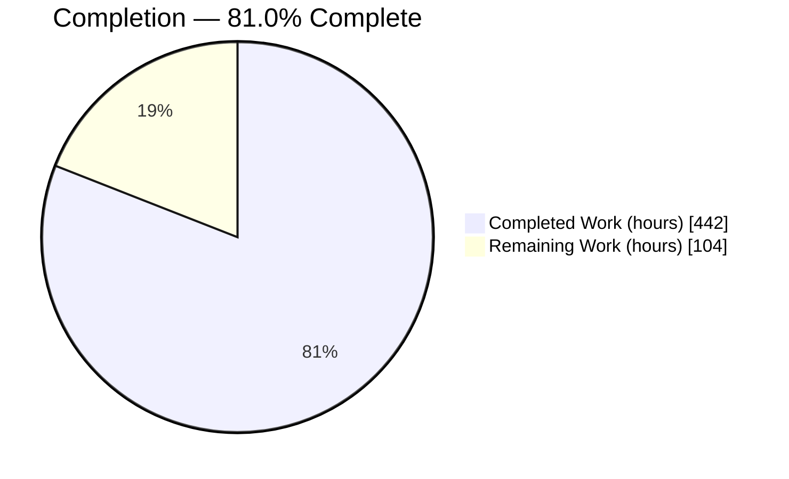
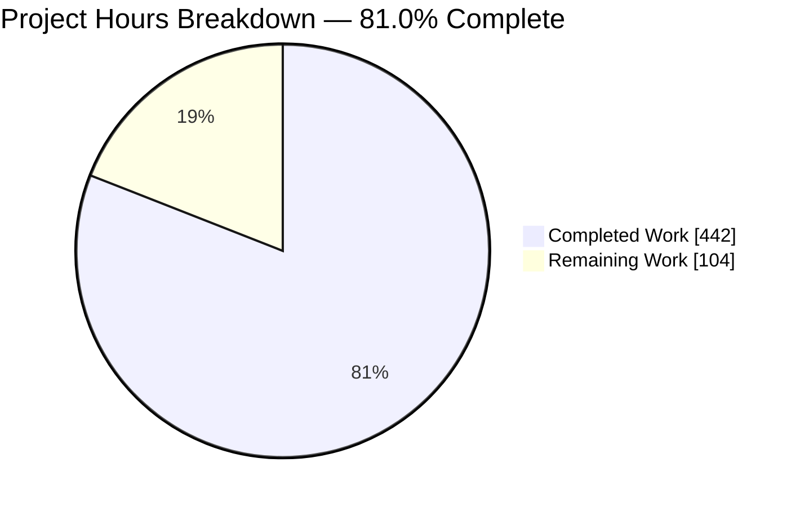
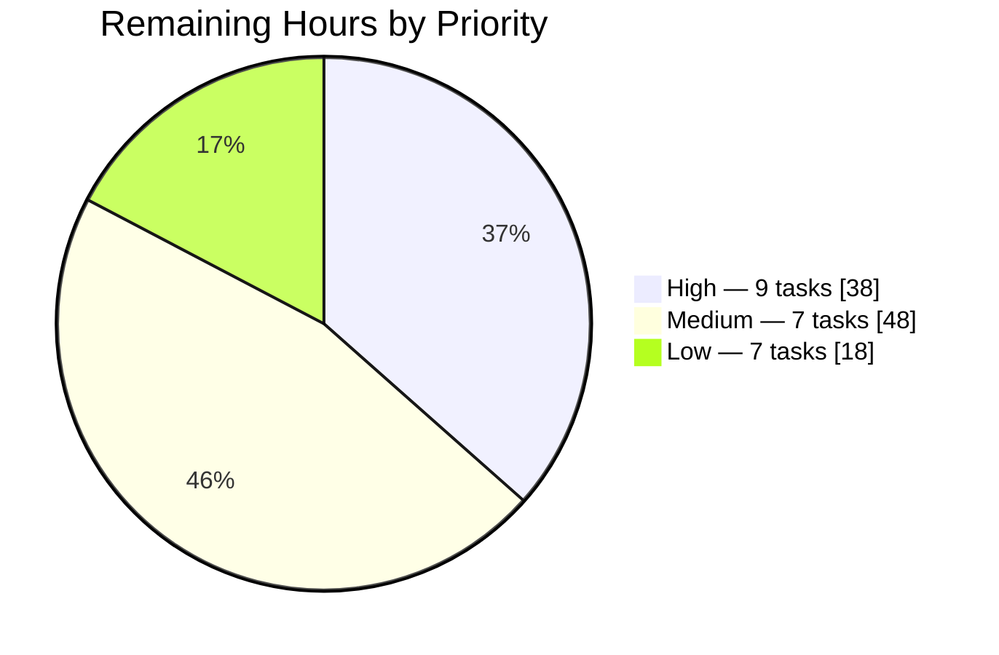
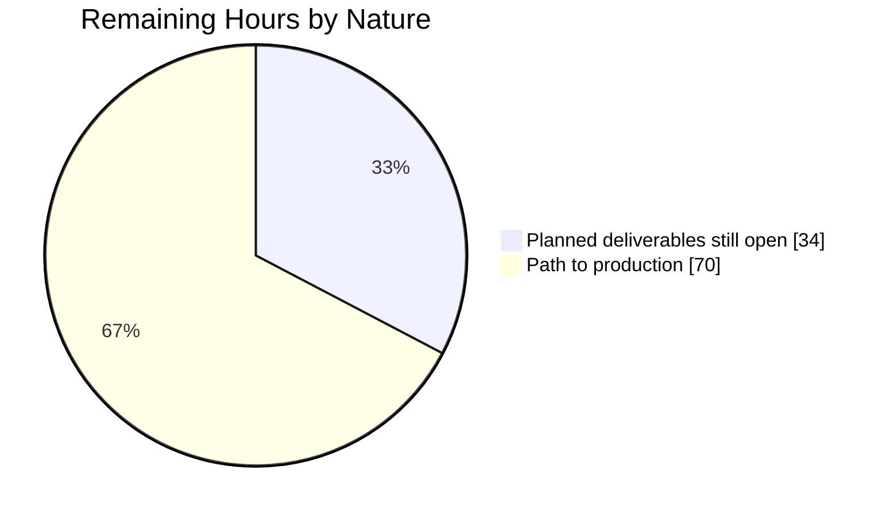

# 1. Executive Summary

## 1.1 Project Overview

This project builds an additive cloud-warehouse bridge over the fixed GenApp Policy-Issue chain. The five named COBOL artifacts stay byte-for-byte unchanged: translated copies execute under GnuCOBOL with emulated CICS and Db2 services, the post-chain policy and premium values are extracted, one record lands in object storage under a source-system prefix, and the same dbt models populate exactly two canonical relations — `canonical.issued_policy` and `canonical.preissued_rating`. It serves analysts who need policy and rating facts off the mainframe, and future source systems that must join those tables without structural change. Everything sits beneath `modernization/`, with field lineage, execution evidence and architecture documentation.

## 1.2 Completion Status



Completed = Dark Blue `#5B39F3`; Remaining = White `#FFFFFF`.

| Metric | Value |
|---|---:|
| Total Hours | **546** |
| Completed Hours (AI + Manual) | **442** |
| Remaining Hours | **104** |
| Percent Complete | **81.0%** |

Measured over the planned deliverables plus the path-to-production work to deploy them: 442 / 546 = **81.0%**.

## 1.3 Key Accomplishments

- ✅ Five named COBOL artifacts preserved byte-for-byte; the change set is additive and confined to `modernization/`.
- ✅ All three chain programs compile and execute under GnuCOBOL — 12 cases, 902 assertions.
- ✅ The full `00`/`70`/`80`/`90`/`98`/`99` return-code contract and the `LGSQ` abend path exercised.
- ✅ One record lands in object storage under a source-system prefix with a verified digest.
- ✅ Exactly two canonical relations, 20 contract-enforced columns, correct product NULL pattern.
- ✅ The same dbt models serve both targets; only connection and raw loading differ.
- ✅ Every source-derived column traced to a COBOL item; 40 of 40 compared at zero delta.
- ✅ No rating formula anywhere: zero `COMPUTE`, `MULTIPLY` or `DIVIDE` on any amount path.

## 1.4 Critical Unresolved Issues

Twelve items are open against the thirteen acceptance criteria this work was scoped against: one criterion — the cloud-warehouse comparison — is unclosed by design, plus eleven further items. Counts below sum to twelve.

| Issue | Impact | Owner | ETA |
|---|---|---|---|
| Formal comparison against the real cloud warehouse is not performed (1 item) | The transformation is proven only against the local substitute; the cloud path has never run | Platform owner | On credential availability, then 29 h |
| The `raw` schema qualifier is unquoted on the cloud path (1 item) | `raw` is a reserved word in the target warehouse, so the first real DDL and `COPY` would fail | Data engineer | 5 h, before any cloud run |
| The endowment product route is compiled and reachable but never executed (1 item) | That route's runtime behaviour is uncharacterised; the frozen source overflows a fixed-length item on it | Data engineer | 4 h, needs a scope amendment |
| Declared column widths and character semantics are not engine-enforced locally (1 item) | Width and character-set behaviour is unproven on the real engine | Data engineer | 4 h, during the cloud run |
| The host warehouse connection profile is an older copy of the shipped template (1 item) | A bare `dbt` invocation resolves stale connection settings | Platform owner | 0.5 h, re-copy before a cloud run |
| Accepted with a caveat: bounded same-user race windows in the two gates and the driver, and failure-evidence rows collapsing on a shared natural key (2 items) | Each is bounded and documented; neither can produce a false PASS | Data engineer | Alongside the multi-record work |
| Evidence and hygiene residuals: two published artifacts carrying checkout-specific paths, one unused import, the comparison gate's self-test outside the orchestrated order, a missing reached-witness key, and the ignore list at its fixed five entries (5 items) | Cosmetic or diagnostic only; no functional impact | Data engineer | 10 h combined |

## 1.5 Access Issues

| System/Resource | Type of Access | Issue Description | Resolution Status | Owner |
|---|---|---|---|---|
| Object-storage landing bucket | API credentials and an existing bucket | No credentials or region resolve and no bucket is configured, so the precondition probe refuses the cloud branch | Open — needs user-supplied values | Platform owner |
| Cloud warehouse cluster or workgroup | Connection set and IAM | No host, database, user, password, schema, port, cluster id or IAM profile is configured, so the probe refuses | Open — needs user-supplied values | Platform owner |
| `COPY` authorisation role | Role identifier | The loader's authorisation placeholder carries no value | Open — needs user-supplied value | Platform owner |
| Pinned compiler release | Toolchain version | The environment supplies GnuCOBOL 3.2.0 and forbids changing it, so the pinned 3.1.2 release cannot be installed | Accepted — reported as a deviation on every run | Platform owner |
| Legacy CICS/Db2/VSAM runtime | Runtime access | No access to the live mainframe chain, so validation runs translated copies with emulated CICS and Db2 services | Accepted — by design | Not required |

## 1.6 Recommended Next Steps

1. **[High]** Quote or rename the `raw` schema identifier and add dbt quoting configuration — 5 h, a precondition for the cloud target.
2. **[High]** Supply the credential and connection set, then run the closure sequence end to end and change the disposition — 29 h.
3. **[High]** Confirm column widths and character semantics on the real engine while the connection is live — 4 h.
4. **[Medium]** Sequence landing part numbers and promote the four singular tests to relation contracts — 12 h.
5. **[Medium]** Settle the orchestration choice and put the gated order under a scheduler with alerting and a runbook — 22 h.

# 2. Project Hours Breakdown

## 2.1 Completed Work Detail

| Component | Hours | Description |
|---|---:|---|
| Extraction specification & COMMAREA field map | 28 | 17 logical field entries across three tiers with offsets, runtime status, the length-constant analysis and a machine-checkable no-formula census, derived from 1,062 lines of frozen COBOL (`modernization/extraction/copybook_field_map.yml`, `extraction-spec.md`) |
| Sample COMMAREA builder & post-chain extractor | 46 | Two tools that emit full 32,500-character records and decode the returned COMMAREA into the 17-key landing record, with 335 embedded self-test cases (`extraction/build_sample_commarea.py`, `extraction/extract_commarea.py`) |
| Translate-on-copy COBOL translator | 40 | 13 rewrite rules over 11 SQL blocks and 36 CICS sites, fixed-format column enforcement, 93 self-test cases (`harness/translate.py`, `harness/statement_map.yml`, `harness/translation-rules.md`) |
| CICS/Db2 emulation surface | 40 | Driver, four shared copybooks and twelve stubs covering ABEND, ASKTIME, FORMATTIME, WRITE, LINK and seven SQL operations (`harness/driver.cbl`, `harness/copybooks/`, `harness/stubs/`) |
| Harness runner, case suite & evidence publication | 34 | 12 chain cases, 5 infrastructure probes, 902 assertions, exclusive locking, deterministic seeding and evidence staging (`harness/run_harness.sh`) |
| Object-storage landing writer, raw loaders & partition layout | 34 | Landed object plus a one-entry `COPY` manifest with a land-time digest, both load paths, 90 self-test cases (`landing/land_to_s3.py`, `landing/load_local.py`, `landing/load_redshift.sql`, `landing/partition-layout.md`) |
| Warehouse bootstrap DDL | 4 | Schema creation and the all-VARCHAR raw relation (`warehouse/ddl/01_schemas.sql`, `warehouse/ddl/02_raw_genapp_policy_issue.sql`) |
| dbt project — models, enforced contracts & singular tests | 26 | Staging view, intermediate table, two canonical marts with contracts enforced on all 20 columns, custom schema macro, four singular tests (`dbt/genapp_rqi/`) |
| Harness-to-warehouse comparison gate | 30 | Field-by-field comparison of 40 canonical column instances under the ±0.01 amount contract, dual connector, 41 self-test cases (`validation/diff_harness_vs_warehouse.py`) |
| Read-only source & evidence-integrity gate | 20 | Four gates over source hashes, worktree state, tracked modifications and evidence-manifest coverage, 61 self-test cases (`validation/verify_readonly.sh`) |
| Pipeline orchestration & dependency management | 30 | 13-target Makefile driving an 18-stage gated order with guarded value readers and path containment, ten direct pins and a 106-entry hash-pinned lock (`modernization/Makefile`, `requirements.txt`, `requirements-lock.txt`) |
| Security & integrity controls across the delivered surface | 24 | Write confinement on every tool path, artifact hash pinning, object-digest verification between landing and load, owner-only file modes on identifier-bearing artifacts, safe YAML loading, redacted console output |
| Local-substitute branch, precondition gate & disclosure | 8 | Cloud-target probes, target selection recorded before extraction, the mandated disclosure carried through all 11 human-facing deliverables |
| Validation evidence record | 12 | Commands, versions, per-stage results, dispositions and open items (`validation/validation-evidence.md`) |
| Project guide, field-level lineage & architecture documentation | 34 | No-formula finding, built and proposed architectures, the cloud closure runbook, future-source onboarding, per-column lineage, five named Mermaid figures with legends (`docs/project-guide.md`, `docs/field-level-lineage.md`, `docs/architecture.md`) |
| Decision log & bidirectional traceability matrix | 32 | 129 decision rows with alternatives, rationale and risk; forward and reverse coverage of 63 artifacts with zero unmapped items (`docs/decision-log.md`, `docs/traceability-matrix.md`) |
| **Total** | **442** | |

## 2.2 Remaining Work Detail

| Category | Hours | Priority |
|---|---:|---|
| Formal cloud-warehouse validation closure — real object storage and warehouse, end to end | 29 | High |
| Reserved-word schema identifier correction and dbt quoting configuration | 5 | High |
| Real-engine column width and character-set verification | 4 | High |
| Multi-record and multi-source generalisation — landing part sequencing, contract-grade relation tests, cross-mart consistency | 12 | Medium |
| EBCDIC CCSID decode path for a real mainframe extract | 8 | Medium |
| Continuous execution of the gated pipeline — seed and bucket decontention, profile handling, failure alerting | 8 | Medium |
| Production operations runbook and monitoring | 8 | Medium |
| Orchestration decision and implementation plan | 6 | Medium |
| Privacy and security review for any field expansion | 6 | Medium |
| Residual hardening backlog — uniform symlink refusal, diffable gate blocks, checkout-path artifacts, ignore entries, self-test wiring, witness keys | 10 | Low |
| Endowment product route characterisation (requires a scope amendment) | 4 | Low |
| Toolchain reproducibility for the pinned compiler release | 4 | Low |
| **Total** | **104** | |

## 2.3 Hours Calculation Summary

| Measure | Value |
|---|---:|
| Completed hours (Section 2.1 column total) | 442 |
| Remaining hours (Section 2.2 column total) | 104 |
| Total project hours (442 + 104) | 546 |
| Percent complete (442 ÷ 546 × 100) | 81.0% |

The remaining 104 hours resolve into 23 discrete tasks: 9 High-priority tasks totalling 38 hours, 7 Medium-priority tasks totalling 48 hours and 7 Low-priority tasks totalling 18 hours. Of the 104 hours, 34 close planned deliverables that are still open and 70 are standard path-to-production activities — continuous execution, monitoring, an operations runbook, the orchestration decision, the privacy review, multi-record generalisation and toolchain reproducibility.

Confidence is **high** on the first three High-priority categories, because each is a bounded, well-specified change against an existing runbook. It is **medium** on multi-record generalisation and the EBCDIC decode path, where the shape of the real input is not yet known. It is **medium** on the operations and orchestration categories, whose scope depends on the platform decision the plan deliberately leaves open.

# 3. Test Results

Every figure below was observed in a full execution of the gated pipeline (`make -C modernization all`, exit 0) plus a direct invocation of each tool's self-test suite. No count is estimated.

| Area / Category | Framework | Tests | Passed | Failed | Coverage | What This Proves |
|---|---|---:|---:|---:|---|---|
| COBOL chain execution | Harness case table (GnuCOBOL 3.2.0 + shell assertions) | 12 cases | 12 | 0 | 902 assertions over the post-chain COMMAREA and the SQL, VSAM and abend captures | The three programs execute end to end and honour the whole observed return-code contract — `00`, `70`, `80`, `90`, `98`, `99` and the `LGSQ` abend — not only the success route |
| Harness infrastructure refusals | Harness probe table | 5 probes | 5 | 0 | 44 assertions over the module-path, case, fixture and descriptor preconditions | A missing module path, an absent or out-of-tree case, an empty fixture or an unopened capture descriptor each fails with its own distinct status instead of producing a silent partial run |
| Warehouse model build | dbt 1.12.3 | 4 nodes | 4 | 0 | staging view, intermediate table and both canonical marts | The landed record transforms through to exactly two canonical relations with the source-only lineage the models declare |
| Warehouse data tests | dbt 1.12.3 | 64 tests | 64 | 0 | 20 enforced column contracts, both natural keys, the product NULL pattern and the declared widths | The canonical column names, types, nullability, uniqueness and product-specific NULL behaviour hold on materialised data |
| Chain-to-warehouse comparison | Comparison gate (`validation/diff_harness_vs_warehouse.py`) | 2 cases | 2 | 0 | 40 of 40 canonical column instances compared, 0 skipped | Each canonical value reproduces the value the executed chain handed to its insert; all six amount deltas were exactly `0.00`, inside the ±0.01 contract |
| Tool self-test suites | Inline suites across 7 tools | 620 cases | 620 | 0 | source-preservation gate 61, sample builder 115, extractor 220, translator 93, landing writer 47, local loader 43, comparison gate 41 | Decoding, record geometry, translation rules, landing, loading, gate logic and the comparison contract each behave as specified, including their refusal paths |
| Source preservation & evidence integrity | Read-only gate (`validation/verify_readonly.sh`) | 44 gate runs | 44 | 0 | 5 of 5 source digests, 0 tracked modifications, 22 of 22 published evidence paths covered | The five named COBOL artifacts are unchanged, nothing outside the generated evidence set was touched, and every published artifact matches the digest its manifest records |
| Environment & dependency verification | Environment gate | 10 pin checks | 10 | 0 | every direct pin present in the lock at the same version, every lock entry carrying a digest | The interpreter, compiler, version-control tool and full dependency closure sit at or above their recorded security floors before any build work starts |

**Not Covered** — capabilities that were delivered but are not exercised by any test:

- **The cloud-warehouse execution path.** `landing/load_redshift.sql`'s eleven-statement `COPY` sequence, the `redshift` dbt target beyond `dbt parse`, and the comparison gate's cloud connector have never run against a live service. Only their rendering and refusal paths are covered. Test these first once credentials exist.
- **The `raw` schema identifier on the cloud target.** `raw` is a reserved word in that warehouse and the qualifier is unquoted in `warehouse/ddl/01_schemas.sql`, `warehouse/ddl/02_raw_genapp_policy_issue.sql`, `landing/load_redshift.sql` and `dbt/genapp_rqi/models/staging/genapp_class_exemplar/_genapp__sources.yml`, with no dbt quoting configuration. Nothing local can surface this, because the local engine accepts the bare identifier.
- **Credential rejection and bucket-region enforcement.** The local object-storage substitute accepts any credentials and enforces no region, so the authentication-failure and wrong-region branches of the landing writer and loader are untested.
- **Column widths and character-set semantics on the real engine.** The local engine collapses `varchar(n)`/`char(n)` to an unbounded type and accepts bytes the cloud warehouse rejects. The declared bounds are carried locally by value-side assertions and `dbt/genapp_rqi/tests/assert_canonical_column_widths.sql`, not by the engine.
- **The endowment product route.** `harness/stubs/sql_insert_endowment.cbl` is compiled and reachable, but the route is deliberately never entered — the frozen source moves 32,348 bytes into a `PIC X(3900)` item on that path when the COMMAREA length is 32,500. Every case asserts its capture group absent.
- **The pinned compiler release.** The environment supplies GnuCOBOL 3.2.0, so GnuCOBOL 3.1.2 — the version the dependency inventory names — has never compiled this tree.
- **Multi-record and multi-source behaviour.** Every executed case lands exactly one record per product, so same-day multi-record replay from object storage, and rows bearing a second source-system key, are untested.
- **EBCDIC decoding.** A real mainframe extract arrives in the installation code page (CCSID 285 by default); the harness runs in the workstation character set and no test covers a code-page conversion.

# 4. Runtime Validation & UI Verification

This project delivers command-line tooling, COBOL modules, SQL, YAML and documentation. It has no user interface, no component library and no visual surface, so there is nothing to verify in a browser. The runtime validation below covers the executable flows, the data path and each external integration, all observed in a full run of the gated order.

- ✅ **Operational — Pipeline orchestration.** `make -C modernization all` completed every one of its 18 stages and exited 0, stopping nowhere. `make --dry-run all` also exits 0 across 1,334 recipe lines.
- ✅ **Operational — Environment verification.** The interpreter, compiler, version-control tool, virtual environment, ten dependency pins and the hash-pinned lock were all measured before any build work; the stage passed, reporting four version deviations against its recorded pins.
- ✅ **Operational — Translate and compile.** Read-only copies of the three programs plus the two verbatim copybooks were generated, and 15 callable modules and one executable driver compiled with zero errors and zero compiler warnings.
- ✅ **Operational — Chain execution.** All 12 cases ran the `LGAPOL01` → `LGAPDB01` → `LGAPVS01` sequence with both hops at length 32,500. The two product cases returned `00` with policy numbers assigned and read back; the ten characterisation cases produced their expected return codes and abend behaviour.
- ✅ **Operational — Extraction and landing.** Each post-chain COMMAREA decoded into a 17-key landing record, and each record was written to object storage under `landing/source_system_key=…/entity=policy_issue/extract_date=…/part-NNNN.json` with a one-entry `COPY` manifest recording the object's byte count and digest.
- ✅ **Operational — Raw load and transformation.** Both landed objects loaded into `raw.genapp_policy_issue` after digest verification, and the models built staging, intermediate and both canonical marts with all data tests green.
- ✅ **Operational — Canonical output.** Querying the warehouse directly returns two rows in each relation with the expected values and the correct product-specific NULL pattern: the motor policy carries a payment and a motor premium with all four commercial premiums NULL; the commercial policy carries a payment and all four commercial premiums with the motor premium NULL.
- ✅ **Operational — Comparison and source-preservation gates.** The comparison gate matched all 40 canonical column instances with zero failures and zero amount deltas, and the read-only gate returned PASS at every one of its eleven invocations across the run.
- ⚠ **Partial — Object-storage integration.** Exercised against a local API-compatible substitute on a loopback endpoint. Object creation, key layout, manifest writing, digest verification and replay all work; authentication failure and region enforcement cannot be reproduced there.
- ❌ **Failing — Cloud warehouse integration.** Never exercised at runtime. Both precondition probes refuse for want of credentials and connection settings, so the eleven-statement `COPY` sequence, the cloud dbt target and the cloud comparison connector have executed only as far as template rendering and `dbt parse`. Every result in this project is accordingly labelled as validated against the local substitute rather than the cloud platform.

# 5. Compliance & Quality Review

## 5.1 Compliance Matrix

Each row states where the deliverable stands now, against the benchmark the agreed plan set for it.

| # | Deliverable / Benchmark | Status | Progress | Verified By |
|---|---|---|---:|---|
| 1 | Source preservation — the five named COBOL artifacts unchanged, no pre-existing file modified | ✅ Pass | 100% | Five SHA-256 digests identical to the integration base; the whole change set is 89 added paths with zero modified or deleted, none outside `modernization/` |
| 2 | Extraction specification and metadata spine drive the whole pipeline | ✅ Pass | 100% | `extraction/copybook_field_map.yml` census — 17 logical entries, 16 runtime values, 18 source-derived column instances, 17 landing fields — consumed by the builder, the extractor and the comparison gate |
| 3 | No rating formula, factor or derived column constructed, inferred or backfilled | ✅ Pass | 100% | Machine-checkable census over the three programs: `COMPUTE` 0, `MULTIPLY` 0, `DIVIDE` 0; every amount reaches Db2 through a plain `MOVE` |
| 4 | Exactly two canonical relations, each carrying the source-system discriminator | ✅ Pass | 100% | Catalog query returns only `canonical.issued_policy` (11 columns) and `canonical.preissued_rating` (9 columns); a banned-name scan for registry, quote, loss, formula, factor, commission and provenance columns returns nothing |
| 5 | Canonical schema matches the specified columns, types and nullability | ✅ Pass | 100% | Both marts declare `contract: enforced: true` over all 20 columns; the materialised catalog matches the specification name for name and scale for scale |
| 6 | One record lands in object storage under a source-system prefix before transformation | ✅ Pass | 100% | Object plus a one-entry `COPY` manifest under `landing/source_system_key=…/entity=policy_issue/extract_date=…/part-NNNN.json`; no warehouse object is partitioned |
| 7 | Portable transform — the same model files serve both targets | ⚠ Partial | 85% | The model tree is byte-identical across targets and `dbt parse --target redshift` exits 0 on it; target-specific behaviour is confined to the raw-load stage. Never executed against the cloud warehouse |
| 8 | Complete field lineage, with the source-system key the sole warehouse-assigned exception | ✅ Pass | 100% | All 18 source-derived column instances carry a named COBOL item and locator in `docs/field-level-lineage.md` and `docs/traceability-matrix.md` |
| 9 | Compile, execute and compare evidence for both product samples | ⚠ Partial | 85% | 15 modules and one driver compile clean; both samples return `00`; the comparison gate matches 40 of 40 column instances at zero delta. The cloud-target comparison is still open |
| 10 | Interface preservation — COMMAREA size, call order, link lengths, return conventions | ✅ Pass | 100% | Both hops asserted at length 32,500 in call order across 12 executed cases, spanning the `00`/`70`/`80`/`90`/`98`/`99` contract and the `LGSQ` abend |
| 11 | Explainability — one decision log with alternatives, rationale and risk, plus a bidirectional traceability matrix at full coverage | ✅ Pass | 100% | `docs/decision-log.md` carries 129 uniquely identified rows across the required columns; `docs/traceability-matrix.md` covers 63 artifacts forward and reverse and asserts zero unmapped items in either direction |
| 12 | Visual architecture — Mermaid only, before and after views, every figure named, legended and referenced by name | ✅ Pass | 100% | `docs/architecture.md` carries exactly five Mermaid figures, each with a descriptive name and a visible legend, with the pre-existing, built and proposed states kept distinct and zero raster images |

## 5.2 AAP & Rule Divergences and Gaps

Eight divergences from the agreed delivery plan were identified. Neither project rule — Explainability or Visual Architecture Documentation — is diverged from: both are satisfied in full, as rows 11 and 12 above record.

| What the AAP/Rule Required | What Was Delivered Instead | Why It Diverged | Impact | Remediation |
|---|---|---|---|---|
| 1. Use real object storage and a real cloud warehouse whenever both are available, and close the formal comparison against them | The local-substitute branch, with the formal cloud comparison held open and every deliverable labelled accordingly | No credentials, bucket or warehouse target exists in this environment; the plan forbids provisioning them and forbids blocking on their absence | The transformation is proven only against the local substitute; the cloud path has never executed | Supply the credential and connection set and run the closure sequence — 29 h. **Sanctioned** |
| 2. Install the exact pinned versions of the interpreter, package installer, version-control tool and both warehouse adapters | Five of those pins raised: interpreter 3.12.14, installer 26.2.1, version control 2.51.0, dbt-core 1.12.3, cloud adapter 1.11.1 | The literal set resolves to a SQL-parsing dependency and an installer release carrying published advisories whose fixes are unreachable below these versions | Positive for security; the recorded pins are no longer the installed set, and the environment gate now enforces floors rather than exact equality | None required; the raised floors are the correct baseline |
| 3. Address the raw landing relation as `raw.genapp_policy_issue` on the cloud warehouse | The `raw` qualifier is written unquoted in the schema DDL, the raw table DDL, the cloud loader and the dbt source declaration, with no dbt quoting configuration | Not carried out in this run: the local engine accepts the bare identifier, so no local stage can surface it | The first real DDL or `COPY` on the cloud target would fail, blocking the closure run | Quote the identifier or rename the schema, add dbt quoting configuration, re-run the local pipeline — 5 h |
| 4. Create exactly 61 new files and twelve Makefile targets | 63 authored files and thirteen targets | An adapter-independent width assertion and a hash-pinned lock file were needed; the extra target provisions the local endpoint | Strictly additive; the traceability matrix accounts for all 63 forward and reverse | None required |
| 5. Compile with GnuCOBOL 3.1.2 | Compiled with GnuCOBOL 3.2.0 | The environment supplies 3.2.0 and forbids changing it | The named release has never compiled this tree; numeric-store behaviour depends on compiler configuration | Provision the pinned release or formally accept the 3.2 series — 4 h |
| 6. Land the object at the literal key `part-0000.json` | The key carries a part element, `part-<NNNN>.json`, defaulting to `0000` | Two same-day records for one source key would otherwise overwrite each other, making object storage unreplayable | Strictly additive; the default key is unchanged | None required for the current single-record flow |
| 7. Execute the chain for the motor and commercial samples | Twelve cases and five infrastructure probes across three fixtures; the endowment route deliberately not entered | Two success cases cannot represent the six-code return contract the plan documents; the frozen source overflows a fixed-length item on the endowment path | Positive for coverage, except that the endowment route stays uncharacterised | Characterise the endowment route under a scope amendment — 4 h |
| 8. Retain the return code in the raw and staging layers for evidence and failure analysis | The landing contract admits `00` only, so a non-successful execution never lands | A success-only landing decision taken during delivery | Raw and staging keep the column and its full domain, but a failed execution is not represented in the warehouse | Decide whether failed executions belong in the raw layer; no change if not |

**1 — The formal cloud comparison.** The plan makes real object storage and a real warehouse conditional on a precondition gate and requires the local substitute otherwise, with the formal comparison held open. Both probes refuse here: no credentials or region resolve, no bucket, host, database, user, schema, port, cluster identifier or IAM profile is configured, and the `COPY` authorisation placeholder is empty (`landing/load_redshift.sql`). Nothing was provisioned, as the plan requires. The disclosure that results are validated against the local substitute rather than the cloud platform appears in all eleven human-facing deliverables. This is the one acceptance criterion of thirteen that remains unclosed, and it closes only when the same model files run unmodified against the real target.

**2 — The raised dependency pins.** The plan names exact versions in its dependency inventory. Five were moved upward: the interpreter to 3.12.14, the package installer to 26.2.1, version control to 2.51.0, `dbt-core` to 1.12.3 and the cloud adapter to 1.11.1 (`modernization/requirements.txt`). The lower dbt pair admits only a SQL-parsing dependency release carrying published advisories, and the named installer version carries its own. The environment gate enforces a security floor per tool and reports any difference from the recorded pin, so it passes with four reported deviations rather than failing on exact inequality. `requirements-lock.txt` fixes the resulting closure at 106 artifact-verified distributions. Nothing needs undoing; treat the raised floors as the baseline.

**3 — The unquoted `raw` schema identifier.** `raw` is a reserved word in the target cloud warehouse, and a reserved word is accepted there only as a double-quoted identifier — with every reference to that object then quoted. The qualifier is bare in `warehouse/ddl/01_schemas.sql:27`, `warehouse/ddl/02_raw_genapp_policy_issue.sql`, `landing/load_redshift.sql:300`, `:385` and `:393`, and `dbt/genapp_rqi/models/staging/genapp_class_exemplar/_genapp__sources.yml:59`, and neither `dbt_project.yml` nor the source file carries a `quoting` key. The local engine accepts the bare form, so the whole local pipeline is green and no gate can catch it. The decision is the reader's: quote consistently everywhere, or rename the schema. Either way, settle it before the closure run rather than during it.

**4 — Two extra files and one extra target.** The plan enumerates 61 new files and twelve Makefile targets; the tree holds 63 and thirteen. `dbt/genapp_rqi/tests/assert_canonical_column_widths.sql` exists because the catalog-based width comparison silently no-ops on the local engine, leaving the declared `varchar(n)` and `char(1)` bounds unasserted without it. `requirements-lock.txt` exists to pin every transitive artifact by digest, which the ten direct pins alone cannot do. The `local-endpoint` target starts the loopback object-storage substitute and creates its bucket; it sits outside the ordered run, refuses a non-loopback endpoint or a cloud target by name, and provisions nothing remotely. All 63 files are accounted for in the traceability matrix.

**5 — The compiler version.** The dependency inventory names GnuCOBOL 3.1.2; this environment supplies 3.2.0 and forbids installing another release. The harness reports the difference in every run summary rather than hiding it, and setting the strict-versions switch turns that deviation into a refusal. The practical consequence is narrow but real: the harness's central claim is that translated copies reproduce the legacy chain's runtime behaviour, and the numeric-store semantics that behaviour depends on come from the compiler and its configuration. The mandated compile flags are fixed and applied, which pins the most significant of those semantics. Confirming the named release behaves identically is a four-hour exercise once it can be installed.

**6 — The landing part element.** The plan writes one literal object key per source system, entity and extract date. The delivered key carries a trailing part number defaulting to `0000`, so the single-record path produces exactly the key the plan names. The change exists because a run landing two records for one source key on one date would otherwise write both to the same key and lose the first, leaving object storage unable to rebuild the raw layer on its own. With the part element, a two-case run writes two objects and two manifests and replays completely. Nothing regresses; the open work is sequencing part numbers automatically rather than by caller.

**7 — The executed case set.** The plan names two samples and two executions. The harness runs twelve cases and five probes over three fixtures, because the plan also documents a six-value return-code contract plus an abend path that two success cases cannot demonstrate; the third fixture is generated into the ignored build tree, so the authored sample set is unchanged. The one gap in the other direction is the endowment product route: `harness/stubs/sql_insert_endowment.cbl` compiles and is reachable, but entering it is unsafe because the frozen source moves 32,348 bytes into a `PIC X(3900)` item when the COMMAREA length is 32,500. Every case asserts that capture group absent. Characterising it needs an explicit scope decision.

**8 — Success-only landing.** The plan states that the raw and staging layers retain the return code for evidence and failure analysis, and that the mart filters to `00`. As delivered, the filter sits one layer earlier: `landing/landing-schema.json` admits `00` only, so a non-successful execution produces no landed record at all. Raw and staging do keep the `return_code` column and its full declared domain, and failure evidence is captured separately by the harness, so nothing is silently wrong — but the warehouse cannot answer questions about failed issue attempts. The reader should decide whether failed executions belong in the raw layer; if they do, widening the landing schema and adding a failure grain is the change.

# 6. Risk Assessment

These are forward-looking: what could still go wrong once this bridge is put to work.

| Risk | Category | Severity | Probability | Mitigation | Status |
|---|---|---|---|---|---|
| The reserved-word schema qualifier blocks the first real DDL and `COPY` on the cloud warehouse | Technical | High | High | Quote the identifier or rename the schema, add dbt quoting configuration, and dry-run the DDL against a scratch target before the closure run | Open |
| No decode path exists for an EBCDIC mainframe extract, so a real feed cannot be read | Integration | High | High | Add a code-page-parameterised decode ahead of extraction and characterise it against a real extract before onboarding a production feed | Open |
| Landed-data correctness rests on a per-case comparison gate with no production equivalent | Operational | High | Medium | Carry that weight with bucket policy plus verified object digests, and extend the gate to sample production batches rather than only fixture cases | Open |
| Customer, policy and broker identifiers are personal data, and masking, retention and access control are outside this scope | Security | High | Medium | Keep the field set minimal, and require the documented privacy and security review before any field expansion or real customer data | Accepted with caveat |
| Column widths and character-set semantics are unproven on the real engine, which enforces both where the local one does not | Technical | Medium | Medium | Value-side and catalog assertions carry the declared bounds locally; confirm them on the real engine during the closure run | Mitigated locally |
| Cloud connection settings, credential rejection and the orchestration platform are all unresolved, so there is no automated source-to-canonical path | Integration | Medium | High | Supply and validate the connection set, exercise the refusal paths against the live service, then settle the orchestration choice and implement it | Open |
| The pipeline is invoked by hand with no scheduled execution, monitoring or alerting, so a silent failure between runs goes unnoticed | Operational | Medium | High | Run the gated order under a scheduler with alerting on gate exit codes, and add row-count and freshness checks on both canonical relations | Open |
| Residual accepted items: the four singular tests encode today's fixture as an invariant, the endowment route is uncharacterised, the pinned compiler is unexercised, the cross-mart build is not atomic, same-day replay is lossy without part sequencing, and bounded same-user race windows remain in the gates and driver | Mixed | Low | Medium | Each is documented with its bound and its detection path; address them alongside the multi-record generalisation and hardening work | Accepted with caveat |

Two notes on how to read the table. First, the highest-severity items cluster on the cloud path, which is exactly the surface no runtime check has touched — the local pipeline being green says nothing about them. Second, the residual row is deliberately aggregated: none of its members can produce a wrong result silently, but the fixture-shaped singular tests will begin failing on legitimate data growth (a second extract, a second source system, a backfill), so treat them as characterisation checks of today's data rather than contracts on the relations until they are generalised.

# 7. Visual Project Status

**Overall hours** — Completed = Dark Blue `#5B39F3`, Remaining = White `#FFFFFF`.



**Remaining work by priority** (104 hours across 23 tasks).



**Remaining work by nature** — planned deliverables still open versus standard path-to-production activity.



**Where the remaining hours sit**, by category from Section 2.2:

| Category | Hours | Share of remaining |
|---|---:|---:|
| Formal cloud-warehouse validation closure | 29 | 27.9% |
| Multi-record and multi-source generalisation | 12 | 11.5% |
| Residual hardening backlog | 10 | 9.6% |
| EBCDIC decode path | 8 | 7.7% |
| Continuous execution of the gated pipeline | 8 | 7.7% |
| Production operations runbook and monitoring | 8 | 7.7% |
| Orchestration decision and plan | 6 | 5.8% |
| Privacy and security review | 6 | 5.8% |
| Reserved-word schema identifier correction | 5 | 4.8% |
| Real-engine width and character-set verification | 4 | 3.8% |
| Endowment route characterisation | 4 | 3.8% |
| Toolchain reproducibility | 4 | 3.8% |
| **Total** | **104** | **100%** |

# 8. Summary and Recommendations

This project is **81.0% complete** — 442 of 546 hours — measured over the planned deliverables plus the standard path-to-production work needed to deploy them. What was asked for has largely been built and, more importantly, made verifiable. The five named COBOL artifacts are untouched: the entire change set is 89 added files with nothing modified or deleted anywhere in the repository, and the five source digests match the integration base exactly. Translated copies of `LGAPOL01`, `LGAPDB01` and `LGAPVS01` compile and execute under GnuCOBOL with emulated CICS and Db2 services, across twelve cases and 902 assertions that span the whole observed return-code contract rather than only the happy path. From there a single post-chain record lands in object storage under a source-system prefix with a verified digest, loads into an all-string raw relation, and transforms through to exactly two canonical relations whose 20 columns are contract-enforced and whose product-specific NULL pattern is correct in the materialised data.

The verification is the part worth dwelling on, because it is what makes the rest trustworthy. A comparison gate takes the values the executed chain handed to its inserts and matches them field by field against the canonical rows: 40 of 40 column instances, zero failures, and all six amount deltas exactly `0.00` inside a ±0.01 contract. Sixty-four data tests hold the canonical contracts on real data. Six hundred and twenty inline self-test cases across seven tools cover the decode, geometry, translation, landing, load and comparison logic including their refusal paths. A four-part gate re-runs after every generating stage to confirm the sources are unchanged and every published artifact matches its recorded digest. And the finding this work was commissioned to establish is now machine-checkable rather than asserted: zero `COMPUTE`, `MULTIPLY` or `DIVIDE` statements exist on any amount path, so no rating formula was constructed, inferred or backfilled.

The gap is concentrated and easy to state. Everything above was proven against a local substitute; the cloud platform has never been touched. No credentials, bucket, warehouse host or authorisation role exists in this environment, both precondition probes refuse, and the plan explicitly forbade provisioning them or blocking on their absence — so the eleven-statement `COPY` sequence, the cloud dbt target and the cloud comparison connector have executed only as far as template rendering and a clean `dbt parse`. That single acceptance criterion, one of thirteen, is the largest remaining item at 29 hours. Sitting immediately in front of it is a five-hour issue the reader should not discover on the cluster: `raw` is a reserved word in the target warehouse, the schema qualifier is written unquoted in four places, and no dbt quoting configuration exists — so the first real DDL would fail. Nothing local can surface this, because the local engine accepts the bare identifier.

The critical path is therefore short and ordered. Quote or rename the `raw` identifier and re-run the local pipeline to confirm nothing regresses. Supply the credential and connection set. Run the closure sequence end to end — land, bootstrap, `COPY`, `dbt run` and `dbt test` against the cloud target with the model files unmodified, then the comparison gate through the real connector — and confirm the declared column widths and character semantics on the real engine while the connection is live. That is 38 hours, and it converts a locally-proven transformation into a cloud-validated one. The remaining 66 hours are genuine production readiness rather than plan completion: generalising the four singular tests from fixture characterisation to relation contracts before a second record or source system arrives, sequencing landing part numbers, adding an EBCDIC decode for a real mainframe feed, settling the orchestration choice the plan deliberately left open, putting the gated order under a scheduler with alerting, writing the operations runbook, and completing the privacy review before any field expansion touches real customer data.

**Production readiness: not yet, and for one clear reason.** The engineering is strong, the evidence is unusually complete, and there is no unresolved defect in the delivered local path. But a cloud-warehouse bridge that has never connected to the cloud warehouse cannot be signed off, and the reserved-word identifier means the first attempt would fail rather than merely be untested. Close those two items and this becomes a defensible production candidate for a single source system; the multi-record, monitoring and privacy work is what turns it into a platform a second source system can join.

# 9. Development Guide

Every command below was executed as written. Run all of them from the repository root unless a step says otherwise.

## 9.1 System Prerequisites

| Requirement | Version | Notes |
|---|---|---|
| Operating system | Linux x86-64 | Verified on Ubuntu 25.10 |
| Python | 3.12.x | The harness refuses any other minor series. On this host the 3.12 interpreter is at `/usr/local/bin/python3.12`; `/usr/bin/python3` is 3.13 and must not be used |
| GnuCOBOL (`cobc`) | 3.x, at least 3.1.2 | 3.2.0 is present and works; the harness reports the difference from its pin and continues |
| Git | at least 2.43.7 | Required by the source-preservation gate |
| Disk | ~1.5 GB free | Virtual environment, build tree and the local warehouse file |
| Network | none required | The local branch runs entirely on a loopback endpoint |

```bash
/usr/local/bin/python3.12 --version   # Python 3.12.14
cobc --version | head -1              # cobc (GnuCOBOL) 3.2.0
git --version                         # git version 2.51.0
```

## 9.2 Environment Setup

The virtual environment is per checkout and is not committed. Create it, then install the dependency closure:

```bash
/usr/local/bin/python3.12 -m venv --clear modernization/.venv
modernization/.venv/bin/python -m pip install --upgrade pip==26.2.1
modernization/.venv/bin/python -m pip install --require-hashes -r modernization/requirements-lock.txt
modernization/.venv/bin/python -m pip check
```

Expected: `pip 26.2.1`, then `No broken requirements found.`

The installer version matters. The environment gate treats 26.2.1 as a hard security floor and stops the pipeline below it, naming the pinned and the measured value. `requirements.txt` holds the ten direct pins; `requirements-lock.txt` resolves them into 106 distributions, each with the digest the installer must verify before unpacking. Those digests are the wheels for CPython 3.12 on `linux-x86_64` — on a different interpreter series, platform or architecture the install is refused rather than silently substituted, and the lock is regenerated on that platform from `requirements.txt`.

## 9.3 Local Environment and the Object-Storage Substitute

No cloud credentials exist, so the pipeline runs against a local API-compatible substitute on a loopback endpoint:

```bash
export AWS_ACCESS_KEY_ID=testing AWS_SECRET_ACCESS_KEY=testing
export AWS_REGION=us-east-1 AWS_DEFAULT_REGION=us-east-1
export S3_ENDPOINT_URL=http://127.0.0.1:5100
export S3_BUCKET=genapp-rqi-landing-local-0

make -C modernization local-endpoint
```

Expected on a first run: the server starts and the bucket is created. Expected on a repeat run — the target is idempotent:

```text
local-endpoint: the local substitute already answers at 127.0.0.1:5100, so no server was started
local-endpoint: bucket 'genapp-rqi-landing-local-0' is already present at the local endpoint
```

The target accepts only an `http` loopback endpoint on a port of 1024 or above, refuses a cloud target by name, and provisions nothing remotely. It is not part of the ordered run, so start it before `make all`. Leave `HARNESS_STRICT_TOOL_VERSIONS` unset on this toolchain — setting it turns the compiler-version difference into a refusal.

For a second checkout on the same host, use a distinct bucket and port: bucket `genapp-rqi-landing-local-<n>`, port `5100 + 4n`.

## 9.4 Running the Pipeline

One command runs the whole gated order and stops at the first failure:

```bash
make -C modernization all          # exit 0 on success
make -C modernization --dry-run all   # print the recipe without running it
```

Expected final line: `all: every stage of .../modernization/Makefile completed`.

The order is: environment verification → precondition gate → source baseline → sample records → translate → compile → execute → extract → land → raw load → `dbt run` and `dbt test` → comparison gate → read-only verification. The source-preservation gate re-runs after every generating stage. Any stage runs on its own:

```bash
make -C modernization verify-env     # measure the toolchain and dependency closure
make -C modernization gate           # probe the cloud targets, select the branch
make -C modernization translate
make -C modernization compile
make -C modernization execute
make -C modernization extract
make -C modernization land CASE=01amot
make -C modernization load CASE=01amot
make -C modernization dbt
make -C modernization diff
make -C modernization verify-readonly STAGE=final
```

Overridable variables: `CASE`, `CASES`, `CASES_MODE`, `SOURCE_SYSTEM_KEY`, `EXTRACT_DATE`, `STAGE`, `COBC`, `COBFLAGS`, `DBT_TARGET`, `DBT_PROFILES_DIR`, `HARNESS_STRICT_TOOL_VERSIONS`. Every value is validated before any recipe line runs; one carrying a shell metacharacter is refused outright.

The COBOL harness also runs directly:

```bash
bash modernization/harness/run_harness.sh                  # all 12 cases
bash modernization/harness/run_harness.sh --success-only   # the two product cases
```

Expected for the full run: `result: PASS`, `cases executed: 12; assertions passed: 902`, `probes executed: 5; assertions passed: 44`. For `--success-only`: 2 cases and 243 assertions.

## 9.5 Verification

Source preservation and evidence integrity — expect `verdict: PASS`:

```bash
bash modernization/validation/verify_readonly.sh
```

Every tool's own suite — 620 cases in total, 0 failures, each exiting 0:

```bash
bash modernization/validation/verify_readonly.sh --self-test
modernization/.venv/bin/python modernization/extraction/build_sample_commarea.py --self-test
modernization/.venv/bin/python modernization/extraction/extract_commarea.py --self-test
modernization/.venv/bin/python modernization/harness/translate.py --self-test
modernization/.venv/bin/python modernization/landing/land_to_s3.py --self-test
modernization/.venv/bin/python modernization/landing/load_local.py --self-test
modernization/.venv/bin/python modernization/validation/diff_harness_vs_warehouse.py --self-test
```

Expected case count per suite, in that order:

| Suite | Cases |
|---|---:|
| Source-preservation gate | 61 |
| Sample record builder | 115 |
| Post-chain extractor | 220 |
| Translator | 93 |
| Landing writer | 47 |
| Local loader | 43 |
| Comparison gate | 41 |
| **Total** | **620** |

The models parse against both targets without editing a model file — the cloud target parses from placeholder connection values and attempts no connection:

```bash
modernization/.venv/bin/dbt parse --project-dir modernization/dbt/genapp_rqi --target local_substitute

REDSHIFT_HOST=placeholder.example.com REDSHIFT_USER=u REDSHIFT_PASSWORD=p \
REDSHIFT_DATABASE=d REDSHIFT_SCHEMA=raw \
  modernization/.venv/bin/dbt parse --project-dir modernization/dbt/genapp_rqi --target redshift
```

`dbt build` reports `PASS=4` for the models and `PASS=64` for the data tests. The comparison gate reports `PASS - 2 cases, 40 of 40 canonical column instances compared, 0 failed`.

## 9.6 Example Usage

Run the stages by hand and query the result. The build tree is ignored by version control, so it is the natural place for a scratch record:

```bash
PY=modernization/.venv/bin/python
mkdir -p modernization/harness/build/landing

$PY modernization/extraction/extract_commarea.py \
  --commarea modernization/validation/artifacts/commarea_post_01amot.dat \
  --output modernization/harness/build/landing/manual_01amot.json --overwrite

$PY modernization/landing/land_to_s3.py \
  --record modernization/harness/build/landing/manual_01amot.json

$PY modernization/landing/load_local.py

$PY -c "
import duckdb
c = duckdb.connect('modernization/validation/local.duckdb', read_only=True)
print(c.execute('select policy_number, policy_type, request_id, return_code from canonical.issued_policy order by policy_number').fetchall())
print(c.execute('select policy_number, payment_amount, motor_premium_amount, fire_premium_amount from canonical.preissued_rating order by policy_number').fetchall())
"
```

Expected output:

```text
[(1000001, 'M', '01AMOT', '00'), (1000002, 'C', '01ACOM', '00')]
[(1000001, Decimal('500.00'), Decimal('450.00'), None), (1000002, Decimal('1750.00'), None, Decimal('13500.00'))]
```

Note the product-specific NULL pattern: the motor policy carries a motor premium and no commercial premiums; the commercial policy carries commercial premiums and no motor premium. Inapplicable premiums are NULL, never zero.

The extractor and the landing writer both print a redacted summary line — the policy identity appears as a digest rather than a value. Pass `--show-identifiers` when a human genuinely needs the identifiers.

## 9.7 Troubleshooting

| Symptom | Cause | Resolution |
|---|---|---|
| `verify-env` ends naming a pinned and a measured installer version | The installer is below the 26.2.1 security floor | `modernization/.venv/bin/python -m pip install --upgrade pip==26.2.1` |
| `land_to_s3: no destination bucket is set` (exit 3) | `S3_BUCKET` is unset; the tool creates no bucket | Export `S3_BUCKET` and run `make -C modernization local-endpoint` |
| `make land` or `make load` stops naming a missing setting and naming `local-endpoint` | The loopback endpoint or the bucket is not in place | Run `make -C modernization local-endpoint` before `make all` |
| `local-endpoint` refuses, describing what an endpoint may be | `S3_ENDPOINT_URL` is not `http` on a loopback host with an explicit port ≥ 1024 | Set it to `http://127.0.0.1:5100`; the value is never echoed back |
| `extract_commarea: the destination exists and is left in place` (exit 4) | The output file already exists | Add `--overwrite`, or write to a new path |
| A `make` invocation stops naming a variable and what it accepts | A variable carries whitespace or a shell metacharacter | Pass a single word of letters, digits, `_`, `.`, `/`, `-`; nothing reaches a shell |
| `this Makefile runs with .../modernization as the working directory` | Invoked from the wrong directory | Use `make -C modernization <target>` |
| The run stops on the compiler version difference | `HARNESS_STRICT_TOOL_VERSIONS` is set | Unset it; the difference is reported and non-fatal by default |
| `git status` shows modified files under `validation/artifacts` after a run | The published evidence set is regenerated by every run | `git checkout -- modernization/validation/artifacts/` |
| `dbt build` reports skipped nodes | A source test failed, which skips everything downstream | Run `dbt run` then `dbt test` separately to see the model state |
| The precondition gate selects the local branch | No cloud credentials or connection settings resolve | Expected here; supply them to select the cloud branch |

# 10. Appendices

## A. Command Reference

| Purpose | Command |
|---|---|
| Whole gated order | `make -C modernization all` |
| Print the recipe without running it | `make -C modernization --dry-run all` |
| Measure toolchain and dependency closure | `make -C modernization verify-env` |
| Probe the cloud targets and select the branch | `make -C modernization gate` |
| Start the local object-storage substitute and bucket | `make -C modernization local-endpoint` |
| Translate, compile and execute the chain | `make -C modernization translate compile execute` |
| Extract, land and load one case | `make -C modernization extract land CASE=01amot load CASE=01amot` |
| Build and test the warehouse models | `make -C modernization dbt` |
| Compare the chain against the warehouse | `make -C modernization diff` |
| Source-preservation and evidence gate | `make -C modernization verify-readonly STAGE=final` |
| Harness, all 12 cases | `bash modernization/harness/run_harness.sh` |
| Harness, two product cases only | `bash modernization/harness/run_harness.sh --success-only` |
| Any tool's own suite | `<tool> --self-test` |
| Parse the models against the cloud target | `dbt parse --project-dir modernization/dbt/genapp_rqi --target redshift` |
| Restore the regenerated evidence set | `git checkout -- modernization/validation/artifacts/` |

## B. Port Reference

| Port | Bound by | Notes |
|---|---|---|
| 5100 | Local object-storage substitute, loopback only | Started by `make local-endpoint`; in-memory, so a restart discards every bucket and object |
| 5100 + 4·n | The same substitute for an additional checkout `n` | Use bucket `genapp-rqi-landing-local-<n>` alongside it |
| — | Warehouse | Nothing is bound locally; the local warehouse is a file, and the cloud warehouse port is supplied through the connection settings |

## C. Key File Locations

| Area | Path | Role |
|---|---|---|
| Entry point | `modernization/README.md` | Setup, workflow and measured environment state |
| Orchestration | `modernization/Makefile` | 13 targets; `all` runs the 18-stage gated order |
| Dependencies | `modernization/requirements.txt`, `requirements-lock.txt` | Ten direct pins; 106 digest-verified distributions |
| Read-only sources | `base/src/lgapol01.cbl`, `lgapdb01.cbl`, `lgapvs01.cbl`, `lgcmarea.cpy`, `lgpolicy.cpy` | Never modified; inputs to the translator |
| Metadata spine | `modernization/extraction/copybook_field_map.yml` | Field entries, offsets, runtime status, target columns |
| Extraction | `modernization/extraction/build_sample_commarea.py`, `extract_commarea.py` | Record generation and post-chain decoding |
| Harness | `modernization/harness/translate.py`, `run_harness.sh`, `driver.cbl`, `copybooks/`, `stubs/` | Translation, execution, CICS and Db2 emulation |
| Landing | `modernization/landing/land_to_s3.py`, `load_local.py`, `load_redshift.sql` | Object write plus both raw-load paths |
| Warehouse bootstrap | `modernization/warehouse/ddl/` | Schemas and the raw relation |
| Models | `modernization/dbt/genapp_rqi/models/` | Staging, intermediate and the two canonical marts |
| Model contracts and tests | `modernization/dbt/genapp_rqi/models/marts/canonical/_canonical__models.yml`, `tests/` | Enforced contracts and four singular tests |
| Gates | `modernization/validation/verify_readonly.sh`, `diff_harness_vs_warehouse.py` | Source preservation and the comparison gate |
| Evidence | `modernization/validation/validation-evidence.md`, `artifacts/` | Commands, results and the published artifact set |
| Documentation | `modernization/docs/` | Project guide, lineage, decision log, traceability matrix, architecture |

## D. Technology Versions

| Component | Version |
|---|---|
| Python | 3.12.14 |
| GnuCOBOL (`cobc`) | 3.2.0 |
| Git | 2.51.0 |
| pip | 26.2.1 |
| dbt-core | 1.12.3 |
| dbt-duckdb | 1.11.0 |
| dbt-redshift | 1.11.1 |
| duckdb | 1.5.5 |
| redshift-connector | 2.1.16 |
| boto3 / botocore | 1.43.74 |
| moto | 5.2.2 |
| PyYAML | 6.0.3 |
| jsonschema | 4.26.0 |

Mandated compile flags, fixed and applied on every module: `-std=ibm -fbinary-truncate -ffold-copy=LOWER -ext cpy`. Callable modules build with `-m`, the driver with `-x`.

## E. Environment Variable Reference

| Variable | Default | Purpose |
|---|---|---|
| `AWS_ACCESS_KEY_ID`, `AWS_SECRET_ACCESS_KEY` | — | Object-storage credentials; any value works against the local substitute |
| `AWS_REGION`, `AWS_DEFAULT_REGION` | — | Region for the object-storage client |
| `S3_ENDPOINT_URL` | unset | Selects the local substitute; unset it to address the cloud service |
| `S3_BUCKET` | — | Existing landing bucket; no tool creates one |
| `SOURCE_SYSTEM_KEY` | `GENAPP_CLASS_EXEMPLAR` | Discriminator on both canonical relations and in the landing prefix |
| `EXTRACT_DATE` | run date | Date element of the landing prefix |
| `LOCAL_DUCKDB_PATH` | `modernization/validation/local.duckdb` | Local warehouse file |
| `DBT_TARGET` | `local_substitute` | Accepts `local_substitute`, `redshift` or nothing |
| `DBT_PROFILES_DIR` | user default | Connection profile directory; validated before any recipe runs |
| `CASE`, `CASES`, `CASES_MODE` | `01amot`, authored table, `all` | Case selection for `land`, `load` and `execute` |
| `STAGE` | — | Label for a source-preservation gate invocation |
| `COBC`, `COBFLAGS` | `cobc`, mandated flags | Compiler and flag overrides |
| `HARNESS_STRICT_TOOL_VERSIONS` | unset | Set to make any version deviation fatal |
| `HARNESS_POLICY_NUMBER` | `1000001` | Deterministic identity seed; each run reserves 12 consecutive values |
| `REDSHIFT_HOST`, `REDSHIFT_USER`, `REDSHIFT_PASSWORD`, `REDSHIFT_DATABASE`, `REDSHIFT_SCHEMA`, `REDSHIFT_PORT` | — | Cloud warehouse connection; alternatively `REDSHIFT_CLUSTER_ID` with `REDSHIFT_IAM_PROFILE` |
| `REDSHIFT_IAM_ROLE` | — | Authorisation role for the cloud `COPY` |

No secret is committed. `modernization/dbt/genapp_rqi/profiles.example.yml` is the connection template; copy it to the profile directory rather than editing anything inside the checkout.

## F. Developer Tools Guide

| Tool | What it is for | Notable switches |
|---|---|---|
| `harness/translate.py` | Rewrites read-only copies of the three programs for GnuCOBOL | `--self-test` |
| `harness/run_harness.sh` | Builds, compiles and executes the case table, then publishes evidence | `--success-only` |
| `extraction/build_sample_commarea.py` | Emits full 32,500-character sample records | `--self-test` |
| `extraction/extract_commarea.py` | Decodes a post-chain COMMAREA into a landing record | `--output`, `--overwrite`, `--show-identifiers`, `--self-test` |
| `landing/land_to_s3.py` | Validates and writes the object plus its `COPY` manifest | `--record`, `--bucket`, `--part`, `--render-redshift-load`, `--self-test` |
| `landing/load_local.py` | Applies the bootstrap DDL and loads the raw relation | `--show-identifiers`, `--self-test` |
| `validation/diff_harness_vs_warehouse.py` | Compares chain captures against the canonical rows | `--json`, `--expected-dir`, `--refresh-snapshot`, `--dbt-run-results`, `--self-test` |
| `validation/verify_readonly.sh` | Source-preservation and evidence-integrity gate | `--stage`, `--self-test` |

Identifier-bearing values are redacted by default in every tool's console output; `--show-identifiers` carries them when a human needs them.

## G. Glossary

| Term | Meaning |
|---|---|
| COMMAREA | The 32,500-byte communication area the three chain programs share; the interface contract this work preserves |
| Chain | `LGAPOL01` → `LGAPDB01` → `LGAPVS01`, the Policy-Issue sequence treated here as an executable oracle |
| Translate-on-copy | Rewriting CICS and embedded-SQL syntax only in generated copies, so the original sources stay byte-identical |
| Stub | A compiled module standing in for a CICS command or SQL statement, recording the values the chain passed it |
| Capture | The recorded values a stub received — the independent side of the comparison |
| Landing record | The 17-key document written to object storage: the source-system key plus the 16 runtime business values |
| Raw layer | `raw.genapp_policy_issue`, holding every landed field as a string |
| Canonical relation | `canonical.issued_policy` or `canonical.preissued_rating`, the only two output tables |
| Source-system key | The discriminator carried on both canonical relations, letting a future source join without structural change |
| Comparison gate | The check that every canonical value reproduces the executed chain, within ±0.01 on amounts |
| Local substitute | The loopback object-storage service and file-based warehouse standing in for the cloud platform |
| Precondition gate | The probe pair that selects the cloud branch when both cloud targets answer, and the local branch otherwise |
| Return-code contract | The observed `00`/`70`/`80`/`90`/`98`/`99` values, plus the `LGSQ` abend, that the chain sets |
| Product NULL pattern | Only the premiums applicable to a policy's product are populated; the rest are NULL, never zero |
