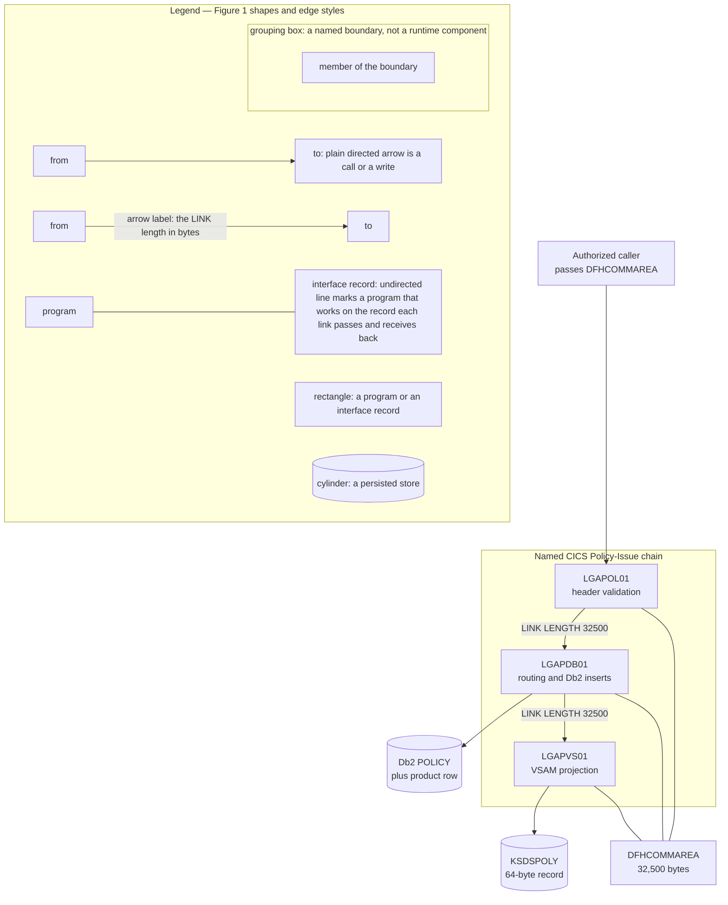
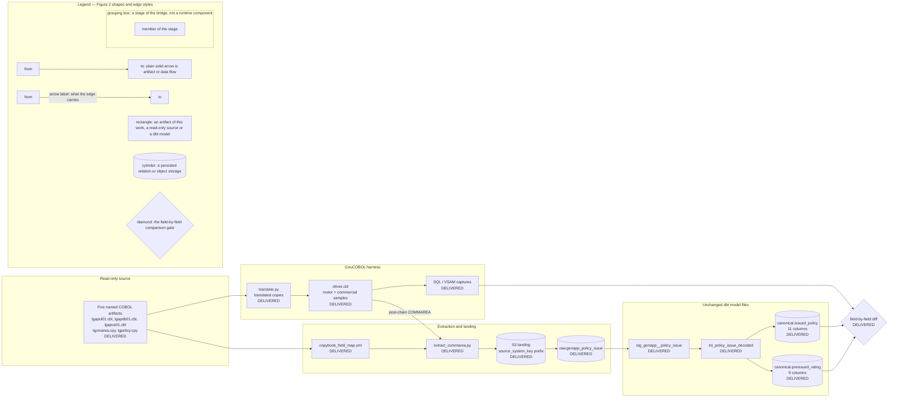
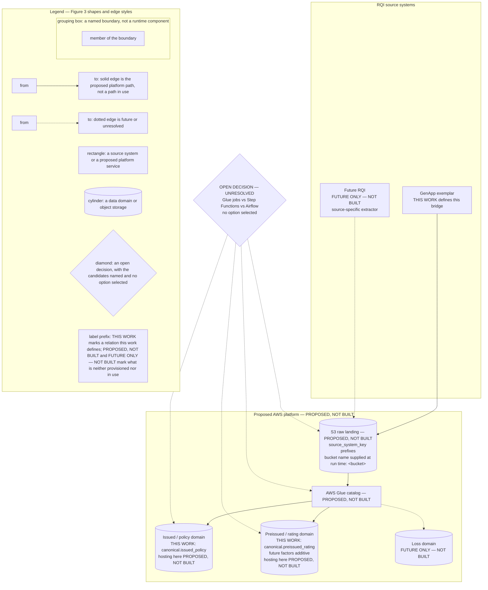
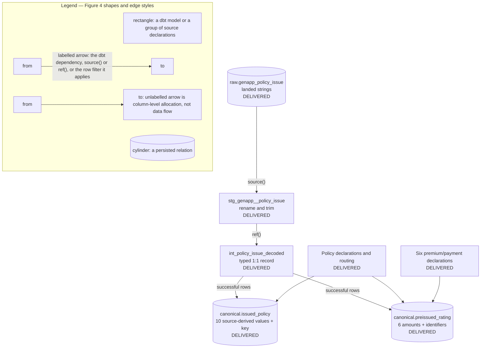
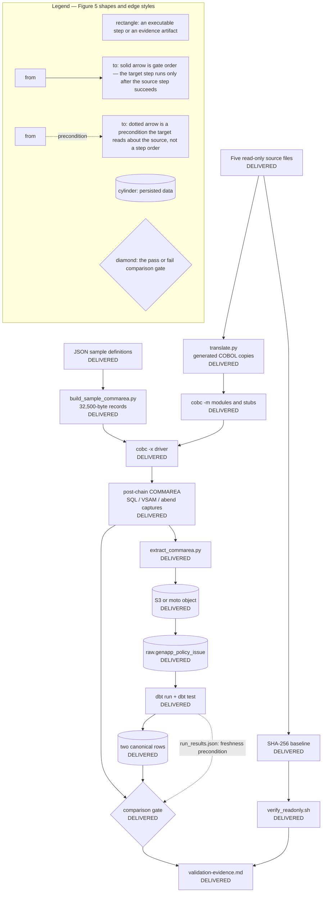

# Architecture — GenApp Policy-Issue Canonical Warehouse Bridge

> **Status — evidence date 2026-08-22.** Figure 1 is the as-is chain, Figures 2, 4 and 5 are the after state of this work
> — delivered in full, as their markers show — and Figure 3 is a proposal. Every artifact these figures name is present in
> the tree. The GnuCOBOL harness is delivered and has run: `translate.py`, the twelve stubs, the four shared copybooks,
> `driver.cbl` and `run_harness.sh` are present, the three translated programs and the twelve stubs compile as `cobc -m`
> modules and the driver as a `cobc -x` executable, and both samples traversed `LGAPOL01`, `LGAPDB01` and `LGAPVS01` with
> `CA-RETURN-CODE` `00`, no abend, the policy and the product SQL capture present, and a 64-byte VSAM record written under
> a 21-byte key. The artifacts downstream of the captures are present as well: `copybook_field_map.yml`,
> `extract_commarea.py`, `landing-schema.json`, `land_to_s3.py`, `load_redshift.sql`, `load_local.py`, the two
> `warehouse/ddl/` scripts and the whole `dbt/genapp_rqi/` project — its manifest, profile template, schema-name macro,
> source declaration, staging model, intermediate model, two canonical mart models, four property files and three
> singular tests — and so are the two artifacts that close the path: the comparison gate
> `modernization/validation/diff_harness_vs_warehouse.py` and the evidence document
> `modernization/validation/validation-evidence.md`. The comparison gate has run: its tracked reports
> `modernization/validation/artifacts/diff-report.md` and `diff-report.json` carry an overall verdict of PASS. The state
> line under each figure records what is present and what has run; `modernization/validation/validation-evidence.md` is
> the consolidated record of every result of that run, and every result stated in this document names the retained
> artifact it is read from. Every result on this path carries the label
> **validated against local substitute, not AWS**; the formal AWS diff requirement is OPEN and this has not yet happened.
> Nothing in this document may be read as closing that requirement, and no figure here depicts a provisioned AWS
> resource.
>
> **Delivery state — the marker pair separates delivered components from contracted ones.** Figures 2, 4 and 5 carry a
> per-component marker in their node text: `DELIVERED` marks a component whose artifact exists in the repository at this
> point, and `PENDING` is its companion marker, reserved for a component this architecture contracts and whose artifact
> does not exist yet. **No component carries `PENDING` at this milestone.** Every component of Figures 2, 4 and 5 is
> `DELIVERED`, the comparison gate and the evidence document included, so the pair is documented here for a reader
> interpreting the markers rather than to describe a current gap. A marker states whether a component's artifact exists,
> never that the component has produced a result: a component is promoted to `DELIVERED` on the existence of its artifact
> alone, and for a persisted relation or object that artifact is the one that creates it — the landing writer, the
> raw-relation DDL or the dbt mart with its enforced contract — never records held in it. What has run is stated by the
> state line under each figure and, result by result, by `modernization/validation/validation-evidence.md`. Figure 1 is
> the unchanged as-is chain and Figure 3 is PROPOSED, NOT BUILT; neither carries the per-component marker pair in its node
> text.
>
> **Delivery position — HARNESS, EXTRACTION, LANDING, RAW LOAD, dbt AND COMPARISON ALL DELIVERED AND EXECUTED; THE
> FORMAL AWS DIFF REQUIREMENT REMAINS OPEN.** Translation, compilation, execution and capture are demonstrated for the
> motor (`01AMOT`, policy number 1000001) and commercial (`01ACOM`, policy number 1000002) samples, and the read-only
> source guard ran at four points of the harness run, verdict PASS in each of the four stage blocks of
> `readonly-check.log`. The `execute` stage selects the case table of `run_harness.sh` through the
> Makefile variable `CASES_MODE`, whose default `all` runs all twelve chain cases — 902 assertions — and whose value
> `success-only` runs the two success cases alone; the five infrastructure probes that precede the cases each asserted
> their driver status. The whole observed return-code contract — `00`, `70`, `80`, `90`, `98`, `99` and the `LGCA` and
> `LGSQ` abends — is therefore exercised by the default selection, case by case, as recorded in section 7 of
> `modernization/validation/validation-evidence.md`; only the two success cases carry a landing record, and the ten
> characterisation cases feed nothing downstream. Downstream of the captures the same run
> recorded: one landing record of 17 keys per case; one landed object with its COPY manifest per case under the documented
> prefix; two rows in `raw.genapp_policy_issue`; `dbt run` PASS=4 and `dbt test` PASS=64 with no warning and no error,
> leaving schema `canonical` holding exactly `issued_policy` and `preissued_rating` with two rows each; and a comparison
> verdict of PASS over 40 of 40 canonical column instances across the two cases, with 0 column failures, 0 missing fields
> and 0 non-zero delta inside the ±0.01 tolerance. `modernization/landing/load_redshift.sql` is authored and was not
> executed on this branch. The retained evidence is the 24 tracked files in `modernization/validation/artifacts/` and the
> two capture snapshots under `modernization/validation/expected/`, indexed file by file in section 13 of the evidence
> document. `evidence-manifest.sha256` names the run that published the harness set, the case selection that run used and
> one SHA-256 line per published file — 22 digest lines, covering every generated evidence path of the set except the
> manifest itself, which carries no digest of itself — so `sha256sum -c evidence-manifest.sha256` in that directory checks
> that set against the run and the stages that wrote it. The remaining artifacts are published by the `Makefile` stages
> named in that index, each of which records its own entry as it publishes, and `runtime-versions.txt` is the environment
> record of the checkout and is published by no run. The read-only gate verifies that coverage as its fourth check, so a
> published artifact that does not match its entry fails the gate (`D-121`). Every result above carries the
> local-substitute label.

This document is the single home of the five named figures listed below; the other documents under `modernization/` are
required to cite them by name instead of reproducing them. This document states what the architecture **is** and what its
status is; every "why" belongs in
`modernization/docs/decision-log.md`, the single source of
truth for rationale.

## Figure index

| # | Figure name | Architectural state |
|---|---|---|
| 1 | [Figure 1 — BEFORE: GenApp Policy-Issue Chain, As-Is](#figure-1) | Before — the as-is chain, unchanged by this work |
| 2 | [Figure 2 — AFTER (BUILT): Canonical Warehouse Bridge](#figure-2) | After — the built bridge; every artifact it names is present at this milestone, from the read-only sources through the harness, extraction, landing, raw relation and dbt models to the field-by-field diff, and the whole path has run for both samples; every component marked `DELIVERED` in the figure and none `PENDING`; run status per `modernization/validation/validation-evidence.md` and the retained logs in `modernization/validation/artifacts/` |
| 3 | [Figure 3 — AFTER (PROPOSED, NOT BUILT): AWS-Native Multi-RQI Warehouse](#figure-3) | Proposed — **not built**; the only figure containing unbuilt services and future domains; carries no `DELIVERED`/`PENDING` marker |
| 4 | [Figure 4 — dbt Transformation DAG and Field Allocation](#figure-4) | After — the delivered model graph and column allocation; the raw relation, both dbt models and both canonical mart models are present at this milestone, together with their enforced column contracts and the four singular tests, and `dbt run` and `dbt test` have run against these files unchanged; every node marked `DELIVERED` in the figure and none `PENDING`; `dbt run`/`dbt test` status per `modernization/validation/validation-evidence.md` |
| 5 | [Figure 5 — Validation Harness Control Flow](#figure-5) | After — the order of the compile, execute, transform and compare gates; every step it names is present at this milestone, the comparison gate and the evidence document included, and every gate of the order has run; every step marked `DELIVERED` in the figure and none `PENDING`; gate outcomes per `modernization/validation/validation-evidence.md` and the retained logs in `modernization/validation/artifacts/` |

---

## Figure 1 — BEFORE: GenApp Policy-Issue Chain, As-Is

**State at this milestone:** the as-is chain, unchanged by this work and read-only to it.

The named CICS Policy-Issue chain as it stands. This work changes nothing in it.

**Legend:** rectangles are programs or interface records; cylinders are persisted stores; directed arrows are calls or
writes, and an arrow label carries the LINK length in bytes; undirected lines mark the three programs that work on the
32,500-byte `DFHCOMMAREA` interface record — each link passes that record to the linked program and receives its updates
back. The labelled grouping box is a named boundary, not a runtime component. The chain is read-only to this work: no
figure in this document adds a write edge into it.

Interface facts carried by the figure, each confirmed against the read-only sources:

- The COMMAREA is exactly 32,500 bytes: `CA-REQUEST-ID` X(6) + `CA-RETURN-CODE` 9(2) + `CA-CUSTOMER-NUM` 9(10) +
  `CA-REQUEST-SPECIFIC` X(32482) [base/src/lgcmarea.cpy:10-13].
- Each link passes that record and receives the linked program's updates in it: the LINK names
  `Commarea(DFHCOMMAREA)` [base/src/lgapol01.cbl:121-124; base/src/lgapdb01.cbl:243-246], and the values `LGAPDB01`
  places in `CA-POLICY-NUM` and `CA-LASTCHANGED` are read from the record after the chain returns
  [base/src/lgapdb01.cbl:307-321]. The figure asserts that interface contract and nothing further. Where a linked program
  runs, and whether storage is shared or copied, is not established by the authorized sources: they name the linked
  programs and carry the request routing of the chain [base/src/lgapdb01.cbl:184-207], but they contain no CICS resource
  definition and no region-placement or transaction-routing metadata.
- Both links carry `LENGTH(32500)`: `LGAPOL01` links `LGAPDB01` [base/src/lgapol01.cbl:121-124] and `LGAPDB01` links
  `LGAPVS01` [base/src/lgapdb01.cbl:243-246].
- The policy header validated before routing is 28 bytes, declared identically in both programs
  [base/src/lgapol01.cbl:59; base/src/lgapdb01.cbl:65].
- `LGAPDB01` links `LGAPVS01` only after `PERFORM INSERT-POLICY` [base/src/lgapdb01.cbl:219] and the product-specific
  insert [base/src/lgapdb01.cbl:223-241]; the edge ordering in the figure is that sequence.
- The VSAM **record** is 64 bytes and its **key** is 21 bytes — two distinct lengths. `WF-Policy-Key` is
  `WF-Request-ID` X(1) + `WF-Customer-Num` X(10) + `WF-Policy-Num` X(10) = 21 bytes, followed by `WF-Policy-Data` X(43),
  giving a 64-byte record [base/src/lgapvs01.cbl:25-30]; the write states `Length(64)` and `KeyLength(21)`
  [base/src/lgapvs01.cbl:135-141]. The key order is request-type letter, then customer number, then policy number
  [base/src/lgapvs01.cbl:99-101].

---

## Figure 2 — AFTER (BUILT): Canonical Warehouse Bridge

**State at this milestone:** every artifact this figure names is present, and every stage of the path it draws has run.
The five read-only sources, `copybook_field_map.yml`,
`translate.py` and `driver.cbl` are present, and the SQL and VSAM captures exist for both samples in
`modernization/validation/artifacts/captures_01amot.txt` and
`captures_01acom.txt`. The translated copies the translator emits are generated on each run into the git-ignored
`modernization/harness/build/` tree and are not committed artifacts. The extractor `extract_commarea.py`, the landing
writer `land_to_s3.py` with its `landing-schema.json` contract, the two raw loaders `load_redshift.sql` and
`load_local.py`, the raw relation defined by `warehouse/ddl/02_raw_genapp_policy_issue.sql` and both dbt models with the
two canonical mart models are present as authored artifacts, and the comparison gate
`modernization/validation/diff_harness_vs_warehouse.py` closes the path. The recorded results of the run: one landing
record of 17 keys per case, one landed object with its COPY manifest per case, two rows in `raw.genapp_policy_issue`,
`dbt run` PASS=4 and `dbt test` PASS=64, and a comparison verdict of PASS over 40 of 40 canonical column instances in
`modernization/validation/artifacts/diff-report.md`. The consolidated record of every one of those results is
`modernization/validation/validation-evidence.md`; `load_redshift.sql` is authored and was not executed on this branch.
Each recorded result is validated against local substitute, not AWS.

The shape of the additive bridge: the chain of Figure 1 — BEFORE: GenApp Policy-Issue Chain, As-Is acts as the oracle,
and its result is projected into two canonical relations. Each component carries its delivery-state marker.

**Legend:** rectangles are artifacts of this work, read-only sources or dbt models; cylinders are persisted relations or
object storage; the diamond is the comparison gate; solid arrows are artifact or data flow, and an arrow label names what
the edge carries; the labelled grouping boxes are stages of the bridge, not runtime components. **No edge writes to the
read-only sources** — every arrow leaving the source subgraph is a read, and the five named artifacts stay
byte-identical. `DELIVERED` marks a component whose artifact exists in the repository at this point, here every node of
this figure: the five named source files, `copybook_field_map.yml`, the translator, the driver, the SQL and VSAM
captures, the extractor, the landing writer that produces the landed object, the DDL that defines the raw relation, both
dbt models, both canonical mart models with their enforced contracts and the field-by-field diff. No node of this figure
carries `PENDING`, the companion marker this document reserves for a component it contracts and whose artifact does not
exist yet. **A marker states whether a component's artifact exists,
never that the component has produced a result, and for the four cylinders that artifact is the writer, the DDL or the
mart model that creates the store rather than records held in it.** Every stage of this figure has run, and each
stage's result is recorded in `modernization/validation/validation-evidence.md`; every one of those results
carries the label validated against local substitute, not AWS and none of them can close the formal AWS diff
requirement.
The canonical layer holds exactly two relations, `canonical.issued_policy` with 11 columns and
`canonical.preissued_rating` with 9 columns; there is no third canonical relation. The figure specifies one set of dbt model files for the local
and the real target — the same models unmodified on both. Rationale for the translate-on-copy harness, the
target-specific raw loaders and the single warehouse-assigned column belongs to
`modernization/docs/decision-log.md`.

The `driver.cbl` to `extract_commarea.py` edge is labelled "post-chain COMMAREA": two extracted values do not exist
until the chain has run. `CA-POLICY-NUM` is filled from `IDENTITY_VAL_LOCAL()` and `CA-LASTCHANGED` is read back from the
inserted row, both inside `INSERT-POLICY` [base/src/lgapdb01.cbl:308-321].

---

## Figure 3 — AFTER (PROPOSED, NOT BUILT): AWS-Native Multi-RQI Warehouse

**State at this milestone:** the platform is proposed only. No AWS service, hosting arrangement, edge, future domain or
orchestration option in this figure is provisioned, in use or resolved. Two nodes carry a `THIS WORK` prefix and are the
exception the reader must not misread: the issued/policy and preissued/rating domains name the two canonical relations
this work defines, whose dbt mart models are present in the tree at this milestone. What is unbuilt about them is the
hosting this figure proposes, not their definition.

A proposed platform shape for onboarding further source systems. **No AWS service, no hosting arrangement and no edge in
this figure is provisioned or in use.** Every service, future domain and unresolved decision in this document appears here
and nowhere else. Two axes are marked separately in the node labels: whether this work defines a canonical relation, and
whether the platform that would host it is provisioned.

**Legend:** rectangles are source systems or proposed platform services; cylinders are data domains or storage; solid
edges are the proposed platform path for the two relations this work defines — no edge in this figure carries data and
none is in use; dotted edges are future or unresolved; the labelled grouping boxes are named boundaries, not runtime
components; the diamond is the required open orchestration decision, which remains **unresolved** — Glue jobs, Step
Functions and Airflow are listed as candidates with no option selected and no leaning implied. **Every AWS service,
hosting arrangement and edge in this figure is PROPOSED, NOT BUILT.** The AWS Glue catalog is not provisioned, the Loss
domain is future-only and does not exist, and no
derived rating-factor column is created by this work. The two domains marked `THIS WORK` are the relations defined by
Figure 2 — AFTER (BUILT): Canonical Warehouse Bridge, where both carry the `DELIVERED` marker because their dbt mart
models are present in the tree; what this figure adds for them is a proposed place to host them, hosting either of them
on this proposed platform is itself PROPOSED, NOT BUILT, and no service, edge or hosting arrangement here has been
provisioned or run. This figure carries no `DELIVERED`/`PENDING` marker of its own. Bucket, account and
connection values are never written into this document — the S3 node states that the bucket name is supplied at run time
and shows the placeholder `<bucket>` and nothing more. Rationale for leaving orchestration open and for excluding future
domains and factors from the build belongs to
`modernization/docs/decision-log.md`.

---

## Figure 4 — dbt Transformation DAG and Field Allocation

**State at this milestone:** every file this figure names is present in the tree — the source declaration
`_genapp__sources.yml`, the DDL that defines `raw.genapp_policy_issue`, `stg_genapp__policy_issue.sql`,
`int_policy_issue_decoded.sql` and the two mart models `canonical_issued_policy.sql` and
`canonical_preissued_rating.sql`, each with its property file, together with the enforced column contracts those
property files declare and the four singular tests under `modernization/dbt/genapp_rqi/tests/`. `dbt run` and `dbt test`
have run against these files unchanged — 4 models built, 64 data tests passed, and both canonical relations populated
from every landed record of the run — and the record of that run
belongs to `modernization/validation/validation-evidence.md` rather than to this figure.

The dbt model dependencies inside the bridge, and which source group supplies which canonical relation. Each node carries
its delivery-state marker.

**Legend:** cylinders are persisted relations; rectangles are dbt models or groups of source declarations; arrows
labelled `source()`, `ref()` or `successful rows` are dbt dependencies and the row filter applied when materializing; the
unlabelled lower arrows show column-level allocation rather than data flow. `DELIVERED` marks a node whose artifact
exists in the repository at this point, here every node of this figure: the two source groups, whose read-only
declarations are carried by `copybook_field_map.yml`; the raw relation, defined by
`modernization/warehouse/ddl/02_raw_genapp_policy_issue.sql` and declared as the single dbt source by
`_genapp__sources.yml`; and both dbt models and both canonical mart models under
`modernization/dbt/genapp_rqi/models/`, the marts creating their relations under the aliases `issued_policy` and
`preissued_rating`. No node of this figure carries `PENDING`, the companion marker this document reserves for a node it
contracts and whose artifact does not exist yet. **A marker states whether a node's artifact exists, never
that the node has been materialized, and for the three cylinders that artifact is the DDL or the mart model that creates
the relation rather than rows held in it.** The `dbt run` and `dbt test` outcomes for these models belong to
`modernization/validation/validation-evidence.md` and not here. The
source is consistently
`raw.genapp_policy_issue` — declared once and read only by the staging model — and the marts alias to
`issued_policy` and `preissued_rating` in the `canonical` schema. Policy declarations and routing supply both relations;
the six premium/payment declarations supply `preissued_rating` only. The `10 source-derived values + key` and
`6 amounts + identifiers` annotations are the 11-column and 9-column shapes of
Figure 2 — AFTER (BUILT): Canonical Warehouse Bridge, counted by origin instead of by column.

The two allocation groups resolve to named source items:

- Policy declarations and routing: `CA-REQUEST-ID`, `CA-RETURN-CODE`, `CA-CUSTOMER-NUM` [base/src/lgcmarea.cpy:10-12],
  `CA-POLICY-NUM` [base/src/lgcmarea.cpy:35], `CA-ISSUE-DATE`, `CA-EXPIRY-DATE`, `CA-LASTCHANGED`, `CA-BROKERID`,
  `CA-BROKERSREF` [base/src/lgcmarea.cpy:38-42], and the `DB2-POLICYTYPE` discriminator [base/src/lgpolicy.cpy:43] set by
  request routing [base/src/lgapdb01.cbl:184-207].
- Six premium/payment declarations: `CA-PAYMENT` [base/src/lgcmarea.cpy:43], `CA-M-PREMIUM`
  [base/src/lgcmarea.cpy:73], and `CA-B-FirePremium`, `CA-B-CrimePremium`, `CA-B-FloodPremium`, `CA-B-WeatherPremium`
  [base/src/lgcmarea.cpy:85,87,89,91], with their Db2 counterparts [base/src/lgpolicy.cpy:51,80,91,93,95,97]. The adjacent
  peril-code items [base/src/lgcmarea.cpy:84,86,88,90] are not amounts and are not allocated.

---

## Figure 5 — Validation Harness Control Flow

**State at this milestone:** every artifact this figure names is present and every gate of the order has run. The five
read-only source files, the sample definitions, `build_sample_commarea.py`, `translate.py`, the twelve stubs,
`driver.cbl`, `run_harness.sh`, `verify_readonly.sh`, the extractor `extract_commarea.py`, the landing writer
`land_to_s3.py`, the two raw loaders, the dbt models that `dbt run` and `dbt test` execute, the diff gate
`diff_harness_vs_warehouse.py` and the evidence document
`validation-evidence.md` are all in the tree. The gates executed at this milestone, each with its retained log under
`modernization/validation/artifacts/`, are: the `SRC` to `BASE` to `RO` read-only baseline check, verdict PASS in
`readonly-check.log`; the `SAMPLE` to `BUILD` sample construction, which emits both 32,500-character records; `SRC` to
`TRANS` to `MODS`, which translated the three programs (`translate.log`, `translation-report.json`) and compiled them and
the twelve stubs as `cobc -m` modules; `MODS` and `BUILD` to `DRIVER`, which compiled the driver as a `cobc -x`
executable (`compile.log`); `DRIVER` to `CAP` for every case the `execute` stage selects — by default the whole authored
table, twelve cases and 902 assertions, of which the ten characterisation cases assert a return code, an abend or a route
and feed nothing downstream — with the two success samples each traversing `LGAPOL01`, `LGAPDB01` and
`LGAPVS01` with `CA-RETURN-CODE` `00`, no abend and a 64-byte VSAM record under a 21-byte key (`driver_01amot.log`,
`driver_01acom.log`, `captures_01amot.txt`, `captures_01acom.txt`); `CAP` to `EXT` to `S3O` to `RAWR`, which landed one
17-key record and its COPY manifest per case and loaded two rows into `raw.genapp_policy_issue`; `RAWR` to `DBTRUN` to
`CANON`, `dbt run` PASS=4 and `dbt test` PASS=64 with no warning and no error (`dbt-clean.log`, `dbt-run.log`,
`dbt-test.log`); and the `DIFFG` comparison gate, verdict PASS over 40 of 40 canonical column instances with 0 failures
and 0 missing fields (`diff-report.md`, `diff-report.json`). `DIFFG` to `EVID` and `RO` to `EVID` are closed by
`modernization/validation/validation-evidence.md`, which consolidates every one of those results. Each of those
outcomes is validated against local substitute, not AWS, and the formal AWS diff requirement stays OPEN.

The order in which the gates run when the harness is executed: baseline, sample construction, translation, compilation,
execution, transformation, comparison and read-only verification. A failure at any gate stops the run. Each step carries
its delivery-state marker.

Two properties of the `RO` and `DRIVER` steps as delivered, both carried by the edges of the figure below and stated by
neither node label. `RO` writes its evidence block into `modernization/harness/build/logs/readonly-check.log`, the
generated log directory of the harness, and `run_harness.sh` runs that gate for the fourth time before it collects the
evidence of the run, so the copy published at `modernization/validation/artifacts/readonly-check.log` carries all four
gate blocks of one run and is replaced as one member of the published evidence set — five fixed names plus three per
success case that ran — rather than appended to in place. The manifest that run writes carries those eleven names and,
alongside them, the entry each `Makefile` stage records for the artifact it publishes, so the fourth check of `RO` covers
the whole published set rather than the harness's own part of it (`D-121`). `DRIVER` measures the record it reads on standard input and
refuses any width other than 32,500 characters before it calls `LGAPOL01`, and publishes the width it read as the
`SAMPLE_RECORD_LENGTH` capture that every case asserts, so the `DRIVER` to `CAP` edge cannot carry a result taken from
an incomplete record. Both properties are validated against local substitute, not AWS.

**Legend:** rectangles are executable steps or evidence; cylinders are persisted data; the diamond is the pass/fail
comparison; each solid arrow is gate order — the step at the head runs only after the step at the tail succeeds; the one
dotted arrow is a precondition rather than an order — `DIFFG` reads the dbt run artifact `run_results.json` that
`DBTRUN` wrote and publishes no verdict unless every node recorded there succeeded.
**The source path has no incoming write edge** — `SRC` only ever originates arrows, so the five files are read for hashing
and for translation and are never a target. `DELIVERED` marks a step whose own artifact exists in the repository at this
point, here the five source files, the pinned SHA-256 baseline, the JSON sample definitions, `build_sample_commarea.py`,
the translator, the `cobc -m` modules and stubs, the `cobc -x` driver, the captures, `verify_readonly.sh`, the extractor,
the landing writer that produces the landed object, the DDL that defines the raw relation and the dbt models `dbt run`
and `dbt test` execute to produce the two canonical rows, the comparison gate
`modernization/validation/diff_harness_vs_warehouse.py` and the evidence document
`modernization/validation/validation-evidence.md` — every step of this figure. No step carries `PENDING`, the companion
marker this document reserves for a step it contracts and whose artifact does not exist yet. A marker states
whether a step's artifact exists, never that the step has produced a result: the recorded results of this run are stated
in the state line above and, gate by gate, in the consolidated evidence record. **A step is promoted to `DELIVERED` once
its artifact exists, and what each step produced is stated separately.**
The comparison gate receives two independent inputs: the SQL and VSAM
captures come from the harness stubs, while the canonical rows come from the landed post-chain COMMAREA; request and
return fields are taken from the driver input and the returned COMMAREA. It also reads one input it never compares: the
dbt run artifact of the `DBTRUN` step, the dotted edge of the figure, which is a precondition on the warehouse state
rather than a value under comparison — a state whose last transform is not established as successful is refused and no
verdict is published for it (`modernization/docs/decision-log.md`, rows **D-82** and **D-83**). `verify_readonly.sh` takes the SHA-256 baseline
and feeds the evidence record: its verdict for this milestone is in
`modernization/validation/artifacts/readonly-check.log`, and the comparison verdict it stands beside is in
`modernization/validation/artifacts/diff-report.md`. Every result on this path carries the label
validated against local substitute, not AWS, is consolidated in
`modernization/validation/validation-evidence.md`, and cannot close the formal AWS diff requirement, which remains OPEN.
Rationale for the tolerance rule and for the choice of local
substitutes belongs to `modernization/docs/decision-log.md`.

---

## Figure cross-reference — required by-name references

Each document listed against a figure is required to cite that figure by its exact title, so the by-name requirement can
be checked from one place; the table is that by-name reference contract. Figure names in this table are spelled exactly as
their titles above. Every listed document is present and carries the exact title of the figure it is listed against, so
the contract is closed for all five figures. The Status column records that closure as measured on 2026-08-22 by an
exact-title search over `modernization/` that excludes `.venv`, `harness/build`, `dbt/genapp_rqi/target` and
`dbt/genapp_rqi/logs`; the number beside a document is its count of exact-title occurrences, and the in-tree total counts
every authored file besides this document that carries the title.

| Figure name | Required to reference it by name | Status at this milestone |
|---|---|---|
| Figure 1 — BEFORE: GenApp Policy-Issue Chain, As-Is | `modernization/docs/project-guide.md`, `modernization/README.md` | CLOSED — both present and citing the exact title: `project-guide.md` 2, `README.md` 1. In-tree total: 2 authored files, 3 references |
| Figure 2 — AFTER (BUILT): Canonical Warehouse Bridge | `modernization/docs/project-guide.md`, `modernization/README.md`, `modernization/landing/partition-layout.md`, `modernization/validation/validation-evidence.md` | CLOSED — all four present and citing the exact title: `project-guide.md` 2, `README.md` 1, `partition-layout.md` 1, `validation-evidence.md` 2. In-tree total: 11 authored files, 13 references |
| Figure 3 — AFTER (PROPOSED, NOT BUILT): AWS-Native Multi-RQI Warehouse | `modernization/docs/project-guide.md`, `modernization/docs/decision-log.md` | CLOSED — both present and citing the exact title: `project-guide.md` 2, `decision-log.md` 5. In-tree total: 3 authored files, 8 references |
| Figure 4 — dbt Transformation DAG and Field Allocation | `modernization/extraction/extraction-spec.md`, `modernization/docs/field-level-lineage.md` | CLOSED — both present and citing the exact title: `extraction-spec.md` 1, `field-level-lineage.md` 1. In-tree total: 20 authored files, 22 references |
| Figure 5 — Validation Harness Control Flow | `modernization/README.md`, `modernization/harness/translation-rules.md`, `modernization/validation/validation-evidence.md` | CLOSED — all three present and citing the exact title: `README.md` 1, `translation-rules.md` 3, `validation-evidence.md` 2. In-tree total: 32 authored files, 38 references, plus the tracked evidence artifact `modernization/validation/artifacts/diff-report.md` |

Fifty-five authored files besides this document carry an exact figure title, in 68 file-to-figure pairs — eight files
cite more than one figure, `modernization/README.md` citing all five — and those 68 pairs hold 84 references, seven files
citing one figure more than once. Every one of those references is verifiable here. Six authored files carry no figure
title at all:
`modernization/.gitignore`, `modernization/requirements.txt`,
`modernization/extraction/copybook_field_map.yml`, `modernization/extraction/build_sample_commarea.py`,
`modernization/extraction/sample_input/commarea_01amot.json` and
`modernization/extraction/sample_input/commarea_01acom.json`. Together with
this document that accounts for all 63 authored files. One tracked evidence artifact carries a title as well and is
counted separately from the authored files: `modernization/validation/artifacts/diff-report.md` cites Figure 5.
Generated paths are excluded from the search and from every count here: the `modernization/harness/build/` tree copies
the four shared copybooks verbatim on each run and inherits their titles, `modernization/dbt/genapp_rqi/target` and
`modernization/dbt/genapp_rqi/logs` hold compiled model SQL and run logs, and the git-ignored
`modernization/validation/local.duckdb` stores the compiled SQL of the staging view together with its Figure 4 comment
header.

Per figure, the authored files besides this document that carry the exact title:

- `Figure 1 — BEFORE: GenApp Policy-Issue Chain, As-Is` — 2 files carrying 3 references:
  `modernization/README.md`, `modernization/docs/project-guide.md` (two references).
- `Figure 2 — AFTER (BUILT): Canonical Warehouse Bridge` — 11 files carrying 13 references:
  `modernization/README.md`, `modernization/docs/project-guide.md` (two references),
  `modernization/docs/traceability-matrix.md`, `modernization/landing/partition-layout.md`,
  `modernization/validation/validation-evidence.md` (two references),
  `modernization/extraction/extract_commarea.py`, `modernization/landing/landing-schema.json`,
  `modernization/landing/land_to_s3.py`, `modernization/landing/load_local.py`,
  `modernization/landing/load_redshift.sql`, `modernization/dbt/genapp_rqi/profiles.example.yml`.
- `Figure 3 — AFTER (PROPOSED, NOT BUILT): AWS-Native Multi-RQI Warehouse` — 3 files carrying 8 references:
  `modernization/README.md`, `modernization/docs/project-guide.md` (two references),
  `modernization/docs/decision-log.md` (five references).
- `Figure 4 — dbt Transformation DAG and Field Allocation` — 20 files carrying 22 references:
  `modernization/README.md` (two references), `modernization/extraction/extraction-spec.md`,
  `modernization/docs/field-level-lineage.md`, `modernization/docs/traceability-matrix.md`,
  `modernization/warehouse/ddl/01_schemas.sql`, `modernization/warehouse/ddl/02_raw_genapp_policy_issue.sql`,
  `modernization/dbt/genapp_rqi/dbt_project.yml`, `modernization/dbt/genapp_rqi/macros/generate_schema_name.sql`,
  `modernization/dbt/genapp_rqi/models/staging/genapp_class_exemplar/_genapp__sources.yml`,
  `modernization/dbt/genapp_rqi/models/staging/genapp_class_exemplar/_genapp__models.yml`,
  `modernization/dbt/genapp_rqi/models/staging/genapp_class_exemplar/stg_genapp__policy_issue.sql`,
  `modernization/dbt/genapp_rqi/models/intermediate/_int__models.yml` (two references),
  `modernization/dbt/genapp_rqi/models/intermediate/int_policy_issue_decoded.sql`,
  `modernization/dbt/genapp_rqi/models/marts/canonical/_canonical__models.yml`,
  `modernization/dbt/genapp_rqi/models/marts/canonical/canonical_issued_policy.sql`,
  `modernization/dbt/genapp_rqi/models/marts/canonical/canonical_preissued_rating.sql`,
  `modernization/dbt/genapp_rqi/tests/assert_issued_policy_unique_key.sql`,
  `modernization/dbt/genapp_rqi/tests/assert_preissued_rating_unique_key.sql`,
  `modernization/dbt/genapp_rqi/tests/assert_product_premium_nullability.sql`,
  `modernization/dbt/genapp_rqi/tests/assert_canonical_column_widths.sql`.
- `Figure 5 — Validation Harness Control Flow` — 32 files carrying 38 references: `modernization/README.md`,
  `modernization/Makefile`, `modernization/harness/translation-rules.md` (three references),
  `modernization/validation/validation-evidence.md` (two references),
  `modernization/extraction/sample_input/README.md`, `modernization/docs/traceability-matrix.md`;
  `modernization/validation/diff_harness_vs_warehouse.py` (four references); the four shared copybooks
  `modernization/harness/copybooks/dfheiblk.cpy`, `modernization/harness/copybooks/dfhresp.cpy`,
  `modernization/harness/copybooks/hsqlca.cpy`, `modernization/harness/copybooks/hcapture.cpy`;
  `modernization/harness/statement_map.yml`; the twelve stubs `modernization/harness/stubs/cics_abend.cbl`,
  `modernization/harness/stubs/cics_asktime.cbl`, `modernization/harness/stubs/cics_formattime.cbl`,
  `modernization/harness/stubs/cics_write.cbl`, `modernization/harness/stubs/cics_diag_link.cbl`,
  `modernization/harness/stubs/sql_insert_policy.cbl`, `modernization/harness/stubs/sql_insert_motor.cbl`,
  `modernization/harness/stubs/sql_insert_commercial.cbl`, `modernization/harness/stubs/sql_insert_endowment.cbl`,
  `modernization/harness/stubs/sql_insert_house.cbl`, `modernization/harness/stubs/sql_set_identity.cbl`,
  `modernization/harness/stubs/sql_select_lastchanged.cbl`; `modernization/harness/translate.py`,
  `modernization/harness/driver.cbl`, `modernization/harness/run_harness.sh`;
  `modernization/validation/verify_readonly.sh`; and the four files that also cite Figure 2,
  `modernization/extraction/extract_commarea.py`, `modernization/landing/land_to_s3.py`,
  `modernization/landing/load_local.py` and `modernization/dbt/genapp_rqi/profiles.example.yml`.

Those 67 pairs are the measured closure of the contract in the table above: every document a row names sits inside this
set and carries that row's exact title. Figures 1 and 3 are cited by the human-facing documents only —
`modernization/README.md` and `modernization/docs/project-guide.md` for Figure 1, those two and
`modernization/docs/decision-log.md` for Figure 3 — and no code or contract file carries either title. Figure 2 is cited
by the four documents its row names, by one further document `modernization/docs/traceability-matrix.md` and by six code
and contract files. Figure 5 is cited by the three files its row names and by twenty-nine further files — the `Makefile`,
`modernization/extraction/sample_input/README.md`, `modernization/docs/traceability-matrix.md`, the four shared
copybooks, `modernization/harness/statement_map.yml`, the twelve stubs, `modernization/harness/translate.py`,
`modernization/harness/driver.cbl`, `modernization/harness/run_harness.sh`,
`modernization/validation/verify_readonly.sh`, `modernization/validation/diff_harness_vs_warehouse.py` and the four
landing and dbt files that also cite Figure 2 — besides the tracked evidence artifact
`modernization/validation/artifacts/diff-report.md`.
