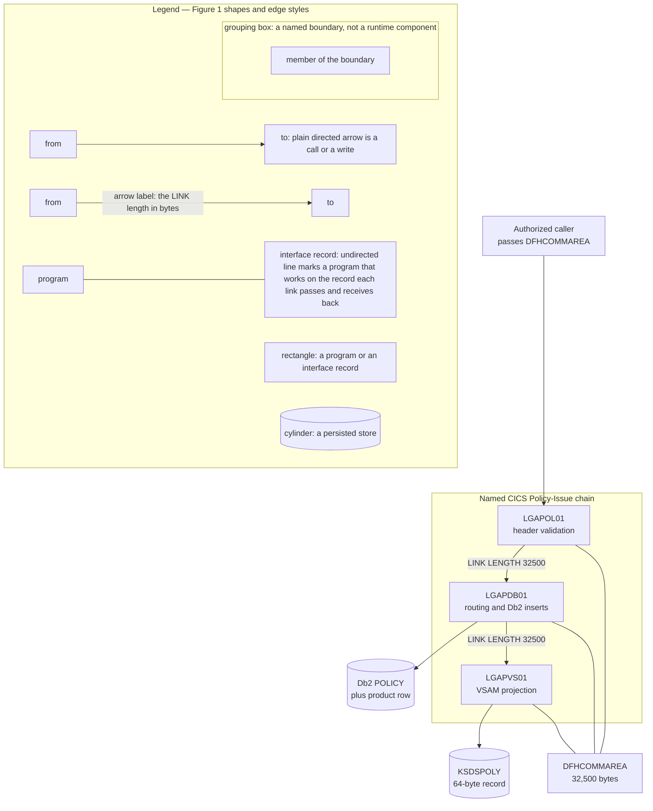
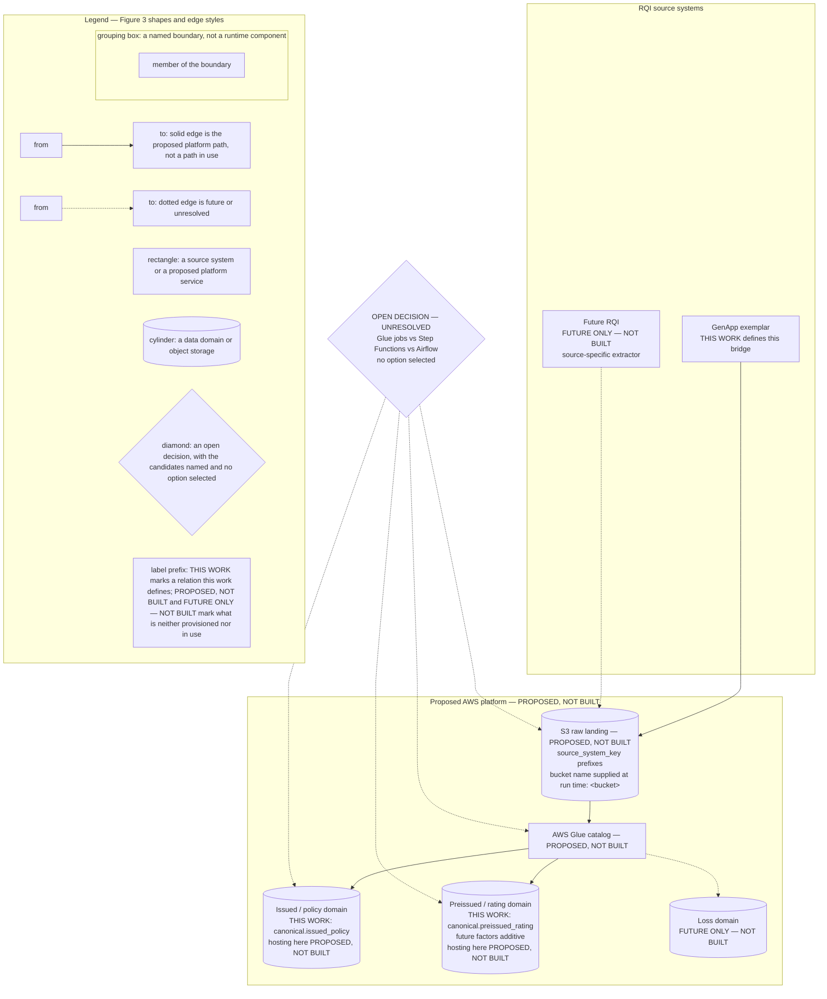
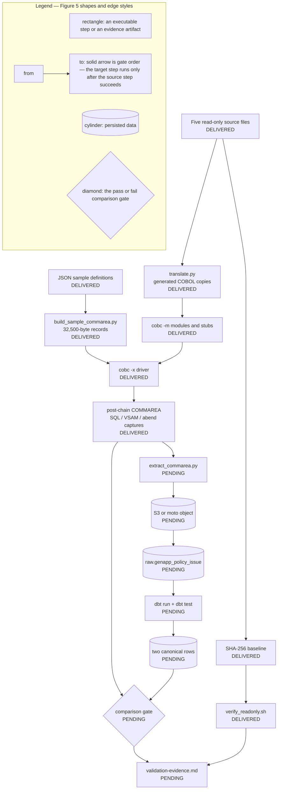

# Architecture — GenApp Policy-Issue Canonical Warehouse Bridge

> **Status — evidence date 2026-08-20.** Figure 1 is the as-is chain, Figures 2, 4 and 5 are the after state of this work
> — delivered in part, as their markers show — and Figure 3 is a proposal. The GnuCOBOL harness these figures name is
> delivered and has run: `translate.py`, the twelve stubs, the four shared copybooks, `driver.cbl` and `run_harness.sh`
> are present in the tree, the three translated programs and the twelve stubs compile as `cobc -m` modules and the driver
> as a `cobc -x` executable, and both samples traversed `LGAPOL01`, `LGAPDB01` and `LGAPVS01` with `CA-RETURN-CODE` `00`,
> no abend, the policy and the product SQL capture present, and a 64-byte VSAM record written under a 21-byte key. The
> artifacts downstream of the captures — the extractor, the landing writers, the raw relation, the dbt model files, the
> diff tool and the evidence document — are not yet present in the tree, so this document claims no extract, land,
> transform or comparison result anywhere; the state line under each figure records what is present and what has run. The
> harness result, and any later result the local path produces, carries the label
> **validated against local substitute, not AWS**; the formal AWS diff requirement is OPEN and this has not yet happened.
> Nothing in this document may be read as closing that requirement, and no figure here depicts a provisioned AWS
> resource.
>
> **Delivery state — the marker pair separates delivered components from contracted ones.** Figures 2, 4 and 5 carry a
> per-component marker in their node text: `DELIVERED` marks a component whose artifact exists in the repository at this
> point, and `PENDING` marks a component this architecture contracts and whose artifact does not exist yet. A `PENDING`
> component is promoted to `DELIVERED` only once its artifact and its evidence exist. The harness components are
> `DELIVERED`; the extraction, landing, raw-load, dbt and comparison components are `PENDING`, and no record has been
> landed or transformed and no comparison has been run. Figure 1 is the unchanged as-is chain and Figure 3 is PROPOSED,
> NOT BUILT; neither carries the per-component marker pair in its node text.
>
> **Delivery position — HARNESS DELIVERED AND EXECUTED; EXTRACTION ONWARD NOT YET DEMONSTRATED.** Translation,
> compilation, execution and capture are demonstrated for the motor (`01AMOT`, policy number 1000001) and commercial
> (`01ACOM`, policy number 1000002) samples, and the read-only source check returned PASS. The same run also drives the
> observed return-code contract — `00`, `70`, `80`, `90`, `98`, `99` and the `LGCA` and `LGSQ` abends — across twelve
> chain cases and five infrastructure probes, and runs the read-only source guard at four points of the run. The
> retained run evidence is in `modernization/validation/artifacts/`: `translate.log`, `compile.log`,
> `translation-report.json`, `source-baseline.sha256`, `driver_01amot.log`, `driver_01acom.log`,
> `captures_01amot.txt`, `captures_01acom.txt`, `commarea_post_01amot.dat`, `commarea_post_01acom.dat`,
> `readonly-check.log` and `runtime-versions.txt`. Extraction, landing, raw load, `dbt run`/`dbt test` and the
> field-by-field diff are NOT YET DEMONSTRATED: their artifacts do not exist and none of them has been run. The
> consolidated record of every result, `modernization/validation/validation-evidence.md`, is itself a planned
> deliverable and is not present at this milestone; until it exists the retained artifacts above are the harness
> evidence, and every result claimed anywhere carries the local-substitute label.

This document is the single home of the five named figures listed below; the other documents under `modernization/` are
required to cite them by name instead of reproducing them. This document states what the architecture **is** and what its
status is; every "why" belongs in
`modernization/docs/decision-log.md` (planned deliverable; not present at this milestone), the planned single source of
truth for rationale.

## Figure index

| # | Figure name | Architectural state |
|---|---|---|
| 1 | [Figure 1 — BEFORE: GenApp Policy-Issue Chain, As-Is](#figure-1) | Before — the as-is chain, unchanged by this work |
| 2 | [Figure 2 — AFTER (BUILT): Canonical Warehouse Bridge](#figure-2) | After — the built bridge; its harness artifacts are delivered and have executed both samples, its extraction, landing, dbt and diff artifacts are not present at this milestone; each component marked `DELIVERED` or `PENDING` in the figure; harness run status per the retained logs in `modernization/validation/artifacts/`, downstream run status per `modernization/validation/validation-evidence.md` once that document exists |
| 3 | [Figure 3 — AFTER (PROPOSED, NOT BUILT): AWS-Native Multi-RQI Warehouse](#figure-3) | Proposed — **not built**; the only figure containing unbuilt services and future domains; carries no `DELIVERED`/`PENDING` marker |
| 4 | [Figure 4 — dbt Transformation DAG and Field Allocation](#figure-4) | After — target state; model dependencies and column allocation; model files not yet present at this milestone; each node marked `DELIVERED` or `PENDING` in the figure; `dbt run`/`dbt test` status per `modernization/validation/validation-evidence.md` once that document exists |
| 5 | [Figure 5 — Validation Harness Control Flow](#figure-5) | After — the order of the compile, execute, transform and compare gates; the baseline, sample, translate, compile, execute and capture steps are delivered and have run, the extract, land, raw-load, dbt and compare steps are not present at this milestone; each step marked `DELIVERED` or `PENDING` in the figure; executed gate outcomes per the retained logs in `modernization/validation/artifacts/`, remaining gate outcomes per `modernization/validation/validation-evidence.md` once that document exists |

---

## Figure 1 — BEFORE: GenApp Policy-Issue Chain, As-Is

**State at this milestone:** the as-is chain, unchanged by this work and read-only to it.

The named CICS Policy-Issue chain as it stands. This work changes nothing in it.

**Legend:** rectangles are programs or interface records; cylinders are persisted stores; directed arrows are calls or
writes, and an arrow label carries the LINK length in bytes; undirected lines mark the three programs that work on the
32,500-byte `DFHCOMMAREA` interface record — each link passes that record to the linked program and receives its updates
back. The labelled grouping box is a named boundary, not a runtime component. The chain is read-only to this work: no
figure in this document adds a write edge into it.

Interface facts carried by the figure, each confirmed against the read-only sources:

- The COMMAREA is exactly 32,500 bytes: `CA-REQUEST-ID` X(6) + `CA-RETURN-CODE` 9(2) + `CA-CUSTOMER-NUM` 9(10) +
  `CA-REQUEST-SPECIFIC` X(32482) [base/src/lgcmarea.cpy:10-13].
- Each link passes that record and receives the linked program's updates in it: the LINK names
  `Commarea(DFHCOMMAREA)` [base/src/lgapol01.cbl:121-124; base/src/lgapdb01.cbl:243-246], and the values `LGAPDB01`
  places in `CA-POLICY-NUM` and `CA-LASTCHANGED` are read from the record after the chain returns
  [base/src/lgapdb01.cbl:307-321]. The figure asserts that interface contract and nothing further. Where a linked program
  runs, and whether storage is shared or copied, is not established by the authorized sources: they contain no program
  definition and no routing information.
- Both links carry `LENGTH(32500)`: `LGAPOL01` links `LGAPDB01` [base/src/lgapol01.cbl:121-124] and `LGAPDB01` links
  `LGAPVS01` [base/src/lgapdb01.cbl:243-246].
- The policy header validated before routing is 28 bytes, declared identically in both programs
  [base/src/lgapol01.cbl:59; base/src/lgapdb01.cbl:65].
- `LGAPDB01` links `LGAPVS01` only after `PERFORM INSERT-POLICY` [base/src/lgapdb01.cbl:219] and the product-specific
  insert [base/src/lgapdb01.cbl:223-241]; the edge ordering in the figure is that sequence.
- The VSAM **record** is 64 bytes and its **key** is 21 bytes — two distinct lengths. `WF-Policy-Key` is
  `WF-Request-ID` X(1) + `WF-Customer-Num` X(10) + `WF-Policy-Num` X(10) = 21 bytes, followed by `WF-Policy-Data` X(43),
  giving a 64-byte record [base/src/lgapvs01.cbl:25-30]; the write states `Length(64)` and `KeyLength(21)`
  [base/src/lgapvs01.cbl:135-141]. The key order is request-type letter, then customer number, then policy number
  [base/src/lgapvs01.cbl:99-101].

---

## Figure 2 — AFTER (BUILT): Canonical Warehouse Bridge

**State at this milestone:** the harness stage is delivered and has run; no stage after it is delivered or has run. Of
the artifacts this figure names, the five read-only sources, `copybook_field_map.yml`, `translate.py` and `driver.cbl`
are present, and the SQL and VSAM captures exist for both samples in
`modernization/validation/artifacts/captures_01amot.txt` and
`captures_01acom.txt`. The translated copies the translator emits are generated on each run into the git-ignored
`modernization/harness/build/` tree and are not committed artifacts. The extractor, the landing writer, the raw relation,
the dbt model files and the diff tool are not present, and no extract, land, transform or comparison result exists.

The shape of the additive bridge: the chain of Figure 1 — BEFORE: GenApp Policy-Issue Chain, As-Is acts as the oracle,
and its result is projected into two canonical relations once the stages after the captures exist. Each component carries
its delivery-state marker.

**Legend:** rectangles are artifacts of this work, read-only sources or dbt models; cylinders are persisted relations or
object storage; the diamond is the comparison gate; solid arrows are artifact or data flow, and an arrow label names what
the edge carries; the labelled grouping boxes are stages of the bridge, not runtime components. **No edge writes to the
read-only sources** — every arrow leaving the source subgraph is a read, and the five named artifacts stay
byte-identical. `DELIVERED` marks a component whose artifact exists in the repository at this point, here the five named
source files, `copybook_field_map.yml`, the translator, the driver and the SQL and VSAM captures; `PENDING` marks a
component this figure contracts and whose artifact does not exist yet, here the extractor, the landed object, the raw
relation, both dbt models, both canonical relations and the diff. **The two markers separate what exists at this point
from what does not, and a component is promoted to `DELIVERED` only once its artifact and its evidence exist.** The
harness stage carries results at this milestone and every stage after the captures carries none; the harness results
carry the label validated against local substitute, not AWS and cannot close the formal AWS diff requirement.
The canonical layer holds exactly two relations, `canonical.issued_policy` with 11 columns and
`canonical.preissued_rating` with 9 columns; there is no third canonical relation. The figure specifies one set of dbt model files for the local
and the real target — the same models unmodified on both. Rationale for the translate-on-copy harness, the
target-specific raw loaders and the single warehouse-assigned column belongs to
`modernization/docs/decision-log.md` (planned deliverable; not present at this milestone).

The `driver.cbl` to `extract_commarea.py` edge is labelled "post-chain COMMAREA": two extracted values do not exist
until the chain has run. `CA-POLICY-NUM` is filled from `IDENTITY_VAL_LOCAL()` and `CA-LASTCHANGED` is read back from the
inserted row, both inside `INSERT-POLICY` [base/src/lgapdb01.cbl:308-321].

---

## Figure 3 — AFTER (PROPOSED, NOT BUILT): AWS-Native Multi-RQI Warehouse

**State at this milestone:** proposed only. Nothing in this figure — service, edge, domain or orchestration choice — is
provisioned, delivered, in use or resolved.

A proposed platform shape for onboarding further source systems. **No AWS service and no edge in this figure is
provisioned, delivered or in use.** Every service, future domain and unresolved decision in this document appears here and
nowhere else. Two axes are marked separately in the node labels: whether this work defines a canonical relation, and
whether the platform that would host it is provisioned.

**Legend:** rectangles are source systems or proposed platform services; cylinders are data domains or storage; solid
edges are the proposed platform path for the two relations this work defines — no edge in this figure carries data and
none is in use; dotted edges are future or unresolved; the labelled grouping boxes are named boundaries, not runtime
components; the diamond is the required open orchestration decision, which remains **unresolved** — Glue jobs, Step
Functions and Airflow are listed as candidates with no option selected and no leaning implied. **This entire figure is
PROPOSED, NOT BUILT.** The AWS Glue catalog is not provisioned, the Loss domain is future-only and does not exist, and no
derived rating-factor column is created by this work. The two domains marked `THIS WORK` are the relations defined by
Figure 2 — AFTER (BUILT): Canonical Warehouse Bridge, where both carry the `PENDING` marker; this figure adds only a
proposed place to host them, hosting either of them on this proposed platform is itself PROPOSED, NOT BUILT, and nothing
here has been provisioned or run. This figure carries no `DELIVERED`/`PENDING` marker of its own. Bucket, account and
connection values are never written into this document — the S3 node states that the bucket name is supplied at run time
and shows the placeholder `<bucket>` and nothing more. Rationale for leaving orchestration open and for excluding future
domains and factors from the build belongs to
`modernization/docs/decision-log.md` (planned deliverable; not present at this milestone).

---

## Figure 4 — dbt Transformation DAG and Field Allocation

**State at this milestone:** target design. The files this figure names — the source declaration,
`stg_genapp__policy_issue`, `int_policy_issue_decoded` and the two mart models — are not yet present in the tree, so no
dbt run and no populated relation is claimed.

The dbt model dependencies inside the bridge, and which source group supplies which canonical relation. Each node carries
its delivery-state marker.

**Legend:** cylinders are persisted relations; rectangles are dbt models or groups of source declarations; arrows
labelled `source()`, `ref()` or `successful rows` are dbt dependencies and the row filter applied when materializing; the
unlabelled lower arrows show column-level allocation rather than data flow. `DELIVERED` marks a node whose artifact
exists in the repository at this point, here the two source groups, whose read-only declarations are already carried by
`copybook_field_map.yml`; `PENDING` marks a node this figure contracts and whose artifact does not exist yet, here the
raw relation, both dbt models and both canonical relations. **This figure is the contracted target architecture: the two
markers separate what exists at this point from what does not, and a node is promoted to `DELIVERED` only once its
artifact and its evidence exist.** `dbt run` and `dbt test` outcomes for these models belong to
`modernization/validation/validation-evidence.md` (planned deliverable; not present at this milestone) and not here. The
source is consistently
`raw.genapp_policy_issue` — declared once and read only by the staging model — and the marts alias to
`issued_policy` and `preissued_rating` in the `canonical` schema. Policy declarations and routing supply both relations;
the six premium/payment declarations supply `preissued_rating` only. The `10 source-derived values + key` and
`6 amounts + identifiers` annotations are the 11-column and 9-column shapes of
Figure 2 — AFTER (BUILT): Canonical Warehouse Bridge, counted by origin instead of by column.

The two allocation groups resolve to named source items:

- Policy declarations and routing: `CA-REQUEST-ID`, `CA-RETURN-CODE`, `CA-CUSTOMER-NUM` [base/src/lgcmarea.cpy:10-12],
  `CA-POLICY-NUM` [base/src/lgcmarea.cpy:35], `CA-ISSUE-DATE`, `CA-EXPIRY-DATE`, `CA-LASTCHANGED`, `CA-BROKERID`,
  `CA-BROKERSREF` [base/src/lgcmarea.cpy:38-42], and the `DB2-POLICYTYPE` discriminator [base/src/lgpolicy.cpy:43] set by
  request routing [base/src/lgapdb01.cbl:184-207].
- Six premium/payment declarations: `CA-PAYMENT` [base/src/lgcmarea.cpy:43], `CA-M-PREMIUM`
  [base/src/lgcmarea.cpy:73], and `CA-B-FirePremium`, `CA-B-CrimePremium`, `CA-B-FloodPremium`, `CA-B-WeatherPremium`
  [base/src/lgcmarea.cpy:85,87,89,91], with their Db2 counterparts [base/src/lgpolicy.cpy:51,80,91,93,95,97]. The adjacent
  peril-code items [base/src/lgcmarea.cpy:84,86,88,90] are not amounts and are not allocated.

---

## Figure 5 — Validation Harness Control Flow

**State at this milestone:** the flow has run as far as the captures. Of the artifacts this figure names, the five
read-only source files, the sample definitions, `build_sample_commarea.py`, `translate.py`, the twelve stubs,
`driver.cbl`, `run_harness.sh` and `verify_readonly.sh` are present; the extractor, the diff gate and
`validation-evidence.md` are not. The gates executed at this milestone, each with its retained log under
`modernization/validation/artifacts/`, are: the `SRC` to `BASE` to `RO` read-only baseline check, verdict PASS in
`readonly-check.log`; the `SAMPLE` to `BUILD` sample construction, which emits both 32,500-character records; `SRC` to
`TRANS` to `MODS`, which translated the three programs (`translate.log`, `translation-report.json`) and compiled them and
the twelve stubs as `cobc -m` modules; `MODS` and `BUILD` to `DRIVER`, which compiled the driver as a `cobc -x`
executable (`compile.log`); and `DRIVER` to `CAP` for both samples, each traversing `LGAPOL01`, `LGAPDB01` and
`LGAPVS01` with `CA-RETURN-CODE` `00`, no abend and a 64-byte VSAM record under a 21-byte key (`driver_01amot.log`,
`driver_01acom.log`, `captures_01amot.txt`, `captures_01acom.txt`). Each of those outcomes is
validated against local substitute, not AWS. The gates from `CAP` onward have not run: no extract, land, raw-load,
`dbt run` / `dbt test` or comparison gate has been executed. No comparison result exists and the formal AWS diff
requirement stays OPEN.

The order in which the gates run when the harness is executed: baseline, sample construction, translation, compilation,
execution, transformation, comparison and read-only verification. A failure at any gate stops the run. Each step carries
its delivery-state marker.

Two properties of the `RO` and `DRIVER` steps as delivered, both carried by the edges of the figure below and stated by
neither node label. `RO` writes its evidence block into `modernization/harness/build/logs/readonly-check.log`, the
generated log directory of the harness, and `run_harness.sh` runs that gate for the fourth time before it collects the
evidence of the run, so the copy published at `modernization/validation/artifacts/readonly-check.log` carries all four
gate blocks of one run and is replaced as one member of the published evidence set — five fixed names plus three per
success case that ran — rather than appended to in place. `DRIVER` measures the record it reads on standard input and
refuses any width other than 32,500 characters before it calls `LGAPOL01`, and publishes the width it read as the
`SAMPLE_RECORD_LENGTH` capture that every case asserts, so the `DRIVER` to `CAP` edge cannot carry a result taken from
an incomplete record. Both properties are validated against local substitute, not AWS.

**Legend:** rectangles are executable steps or evidence; cylinders are persisted data; the diamond is the pass/fail
comparison; each solid arrow is gate order — the step at the head runs only after the step at the tail succeeds.
**The source path has no incoming write edge** — `SRC` only ever originates arrows, so the five files are read for hashing
and for translation and are never a target. `DELIVERED` marks a step whose own artifact exists in the repository at this
point, here the five source files, the pinned SHA-256 baseline, the JSON sample definitions, `build_sample_commarea.py`,
the translator, the `cobc -m` modules and stubs, the `cobc -x` driver, the captures and `verify_readonly.sh`; `PENDING`
marks a step this figure contracts and whose artifact does not exist yet, here extraction, the landed object, the raw
relation, the dbt run and test, the canonical rows, the comparison gate and the evidence document. A marker states
whether a step's artifact exists, never that the step has produced a result: translation, compilation, execution and
capture have produced results for the motor and commercial samples, while extraction, landing, transformation and
comparison have not been run at all. **The two markers separate what exists at this point from what does not, and a step
is promoted to `DELIVERED` only once its artifact and its evidence exist.**
The comparison gate receives two independent inputs: the SQL and VSAM
captures come from the harness stubs, while the canonical rows come from the landed post-chain COMMAREA; request and
return fields are taken from the driver input and the returned COMMAREA. `verify_readonly.sh` takes the SHA-256 baseline
and feeds the evidence record: its verdict for this milestone is in
`modernization/validation/artifacts/readonly-check.log`, and the comparison verdict it will stand beside does not exist
yet. The harness segment of this flow carries results and the segment from `CAP` onward carries none. Every result on
this path, the harness results already recorded included, carries the label validated against local substitute, not AWS,
will be consolidated in `modernization/validation/validation-evidence.md` (planned deliverable; not present at this
milestone), and cannot close the formal AWS diff requirement, which remains OPEN.
Rationale for the tolerance rule and for the choice of local
substitutes belongs to `modernization/docs/decision-log.md` (planned deliverable; not present at this milestone).

---

## Figure cross-reference — required by-name references

Each document listed against a figure is required to cite that figure by its exact title, so the by-name requirement can
be checked from one place; the table is that by-name reference contract. Figure names in this table are spelled exactly as
their titles above. None of the listed documents is present at this milestone, so this table claims no closure: closure is
claimed only once each listed file exists and contains the figure's exact title.

| Figure name | Required to reference it by name | Status at this milestone |
|---|---|---|
| Figure 1 — BEFORE: GenApp Policy-Issue Chain, As-Is | `modernization/docs/project-guide.md`, `modernization/README.md` | Both planned deliverables; not present — closure not yet verifiable |
| Figure 2 — AFTER (BUILT): Canonical Warehouse Bridge | `modernization/docs/project-guide.md`, `modernization/README.md`, `modernization/landing/partition-layout.md`, `modernization/validation/validation-evidence.md` | All four planned deliverables; not present — closure not yet verifiable |
| Figure 3 — AFTER (PROPOSED, NOT BUILT): AWS-Native Multi-RQI Warehouse | `modernization/docs/project-guide.md`, `modernization/docs/decision-log.md` | Both planned deliverables; not present — closure not yet verifiable |
| Figure 4 — dbt Transformation DAG and Field Allocation | `modernization/extraction/extraction-spec.md`, `modernization/docs/field-level-lineage.md` | Both planned deliverables; not present — closure not yet verifiable |
| Figure 5 — Validation Harness Control Flow | `modernization/README.md`, `modernization/harness/translation-rules.md`, `modernization/validation/validation-evidence.md` | All three planned deliverables; not present — closure not yet verifiable |

Twenty-four authored files besides this document are present at this milestone and already carry an exact figure title, so
those references are verifiable here. The generated `modernization/harness/build/` tree is not counted: it copies the four
shared copybooks verbatim on each run and inherits their titles.

- `Figure 4 — dbt Transformation DAG and Field Allocation` — 3 files: `modernization/warehouse/ddl/01_schemas.sql`,
  `modernization/dbt/genapp_rqi/dbt_project.yml`, `modernization/dbt/genapp_rqi/macros/generate_schema_name.sql`.
- `Figure 5 — Validation Harness Control Flow` — 21 files: the four shared copybooks
  `modernization/harness/copybooks/dfheiblk.cpy`, `modernization/harness/copybooks/dfhresp.cpy`,
  `modernization/harness/copybooks/hsqlca.cpy`, `modernization/harness/copybooks/hcapture.cpy`;
  `modernization/harness/statement_map.yml`; the twelve stubs `modernization/harness/stubs/cics_abend.cbl`,
  `modernization/harness/stubs/cics_asktime.cbl`, `modernization/harness/stubs/cics_formattime.cbl`,
  `modernization/harness/stubs/cics_write.cbl`, `modernization/harness/stubs/cics_diag_link.cbl`,
  `modernization/harness/stubs/sql_insert_policy.cbl`, `modernization/harness/stubs/sql_insert_motor.cbl`,
  `modernization/harness/stubs/sql_insert_commercial.cbl`, `modernization/harness/stubs/sql_insert_endowment.cbl`,
  `modernization/harness/stubs/sql_insert_house.cbl`, `modernization/harness/stubs/sql_set_identity.cbl`,
  `modernization/harness/stubs/sql_select_lastchanged.cbl`; `modernization/harness/translate.py`,
  `modernization/harness/driver.cbl`, `modernization/harness/run_harness.sh`; and
  `modernization/validation/verify_readonly.sh`.

These twenty-four references do not close the by-name contract in the table above, which is closed only per the table's
own rule. Figures 1, 2 and 3 have no in-tree reference yet: every document listed against them in the table above is a
planned deliverable.
