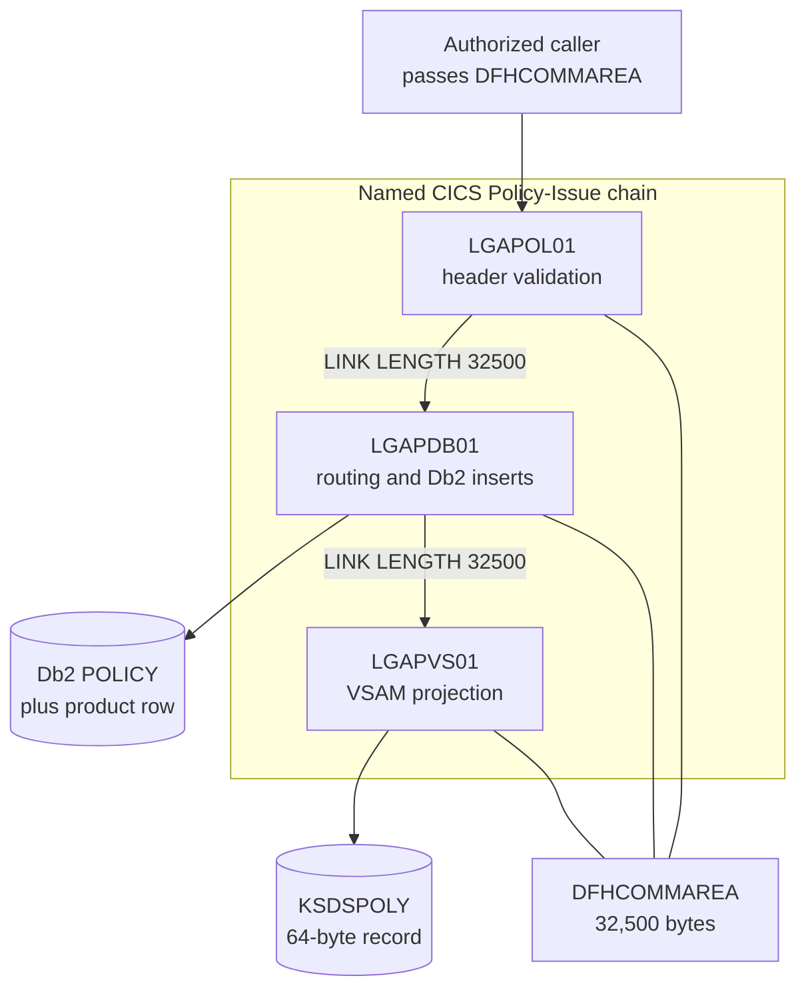
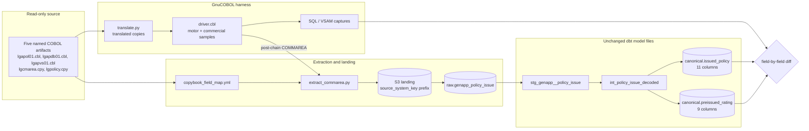
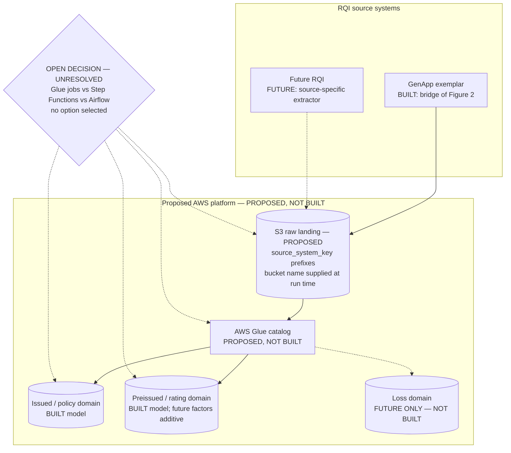
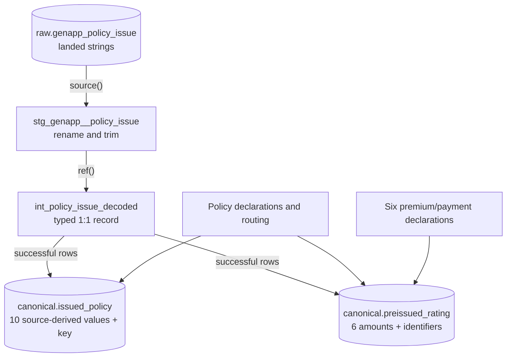
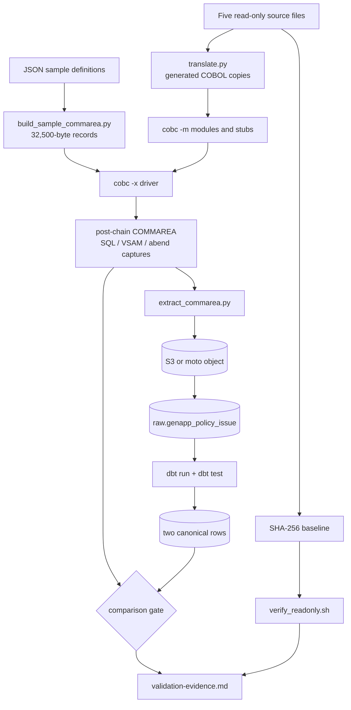

# Architecture — GenApp Policy-Issue Canonical Warehouse Bridge

> **Status — validated against local substitute, not AWS.** The formal AWS diff requirement is OPEN. Nothing in this
> document may be read as closing it, and no figure here depicts a provisioned AWS resource.

This document is the single home of the five named figures listed below; every other document under `modernization/`
references them by name instead of reproducing them. This document states what the architecture **is** — every "why"
lives in `modernization/docs/decision-log.md`, which is the single source of truth for rationale.

## Figure index

| # | Figure name | Architectural state |
|---|---|---|
| 1 | [Figure 1 — BEFORE: GenApp Policy-Issue Chain, As-Is](#figure-1) | Before — the as-is chain, unchanged by this work |
| 2 | [Figure 2 — AFTER (BUILT): Canonical Warehouse Bridge](#figure-2) | After — built, compiled, executed |
| 3 | [Figure 3 — AFTER (PROPOSED, NOT BUILT): AWS-Native Multi-RQI Warehouse](#figure-3) | Proposed — **not built**; the only figure containing unbuilt services and future domains |
| 4 | [Figure 4 — dbt Transformation DAG and Field Allocation](#figure-4) | After — built; model dependencies and column allocation |
| 5 | [Figure 5 — Validation Harness Control Flow](#figure-5) | After — built; compile, execute, transform and compare gates |

---

## Figure 1 — BEFORE: GenApp Policy-Issue Chain, As-Is

The named CICS Policy-Issue chain as it stands. This work changes nothing in it.

**Legend:** rectangles are programs or interface records; cylinders are persisted stores; directed arrows are calls or
writes; undirected lines show the three programs sharing one COMMAREA instance rather than passing a copy. The chain is
read-only to this work: no figure in this document adds a write edge into it.

Interface facts carried by the figure, each confirmed against the read-only sources:

- The COMMAREA is exactly 32,500 bytes: `CA-REQUEST-ID` X(6) + `CA-RETURN-CODE` 9(2) + `CA-CUSTOMER-NUM` 9(10) +
  `CA-REQUEST-SPECIFIC` X(32482) [base/src/lgcmarea.cpy:10-13].
- Both links carry `LENGTH(32500)`: `LGAPOL01` links `LGAPDB01` [base/src/lgapol01.cbl:121-124] and `LGAPDB01` links
  `LGAPVS01` [base/src/lgapdb01.cbl:243-246].
- The policy header validated before routing is 28 bytes, declared identically in both programs
  [base/src/lgapol01.cbl:59; base/src/lgapdb01.cbl:65].
- `LGAPDB01` links `LGAPVS01` only after `PERFORM INSERT-POLICY` [base/src/lgapdb01.cbl:219] and the product-specific
  insert [base/src/lgapdb01.cbl:223-241]; the edge ordering in the figure is that sequence.
- The VSAM **record** is 64 bytes and its **key** is 21 bytes — two distinct lengths. `WF-Policy-Key` is
  `WF-Request-ID` X(1) + `WF-Customer-Num` X(10) + `WF-Policy-Num` X(10) = 21 bytes, followed by `WF-Policy-Data` X(43),
  giving a 64-byte record [base/src/lgapvs01.cbl:25-30]; the write states `Length(64)` and `KeyLength(21)`
  [base/src/lgapvs01.cbl:135-141]. The key order is request-type letter, then customer number, then policy number
  [base/src/lgapvs01.cbl:99-101].

---

## Figure 2 — AFTER (BUILT): Canonical Warehouse Bridge

The additive bridge delivered by this work: the chain of Figure 1 — BEFORE: GenApp Policy-Issue Chain, As-Is is executed
as an oracle, and its result is projected into two canonical relations.

**Legend:** solid arrows are artifact or data flow; cylinders are persisted relations or object storage; the diamond is
the comparison gate. **No edge writes to the read-only sources** — every arrow leaving the source subgraph is a read, and
the five named artifacts stay byte-identical. The canonical layer holds exactly two relations, `canonical.issued_policy`
with 11 columns and `canonical.preissued_rating` with 9 columns; there is no third canonical relation. The dbt model
files are the same files on both the local and the real target. Rationale for the translate-on-copy harness, the
target-specific raw loaders and the single warehouse-assigned column: see `modernization/docs/decision-log.md`.

The `driver.cbl` to `extract_commarea.py` edge is labelled "post-chain COMMAREA": two extracted values do not exist
until the chain has run. `CA-POLICY-NUM` is filled from `IDENTITY_VAL_LOCAL()` and `CA-LASTCHANGED` is read back from the
inserted row, both inside `INSERT-POLICY` [base/src/lgapdb01.cbl:308-321].

---

## Figure 3 — AFTER (PROPOSED, NOT BUILT): AWS-Native Multi-RQI Warehouse

A proposed platform shape for onboarding further source systems. **Nothing in this figure is delivered by this work.**
Every service, future domain and unresolved decision in this document appears here and nowhere else.

**Legend:** solid edges are the proposed platform path used by the built domains; dotted edges are future or unresolved;
cylinders are data domains or storage; the diamond is the required open orchestration decision, which remains
**unresolved** — Glue jobs, Step Functions and Airflow are listed as candidates with no option selected and no leaning
implied. **This entire figure is PROPOSED, NOT BUILT.** The AWS Glue catalog is not provisioned, the Loss domain does not
exist, and no derived rating-factor column is created by this work; the two domains marked BUILT are the relations of
Figure 2 — AFTER (BUILT): Canonical Warehouse Bridge, reached today through the local substitute rather than through this
proposed platform. Bucket, account and connection values are never written into this document — the S3 node shows the
placeholder `<bucket>`. For the reasoning behind leaving orchestration open and excluding future domains and factors from
the build: see `modernization/docs/decision-log.md`.

---

## Figure 4 — dbt Transformation DAG and Field Allocation

The dbt model dependencies inside the bridge, and which source group supplies which canonical relation.

**Legend:** cylinders are persisted relations; rectangles are dbt models or source groups; arrows labelled `source()` and
`ref()` are dbt dependencies; the lower arrows show column-level allocation rather than data flow. The source is
consistently `raw.genapp_policy_issue` — declared once and read only by the staging model — and the marts alias to
`issued_policy` and `preissued_rating` in the `canonical` schema. Policy declarations and routing supply both relations;
the six premium/payment declarations supply `preissued_rating` only. The `10 source-derived values + key` and
`6 amounts + identifiers` annotations are the 11-column and 9-column shapes of
Figure 2 — AFTER (BUILT): Canonical Warehouse Bridge, counted by origin instead of by column.

The two allocation groups resolve to named source items:

- Policy declarations and routing: `CA-REQUEST-ID`, `CA-RETURN-CODE`, `CA-CUSTOMER-NUM` [base/src/lgcmarea.cpy:10-12],
  `CA-POLICY-NUM` [base/src/lgcmarea.cpy:35], `CA-ISSUE-DATE`, `CA-EXPIRY-DATE`, `CA-LASTCHANGED`, `CA-BROKERID`,
  `CA-BROKERSREF` [base/src/lgcmarea.cpy:38-42], and the `DB2-POLICYTYPE` discriminator [base/src/lgpolicy.cpy:43] set by
  request routing [base/src/lgapdb01.cbl:184-207].
- Six premium/payment declarations: `CA-PAYMENT` [base/src/lgcmarea.cpy:43], `CA-M-PREMIUM`
  [base/src/lgcmarea.cpy:73], and `CA-B-FirePremium`, `CA-B-CrimePremium`, `CA-B-FloodPremium`, `CA-B-WeatherPremium`
  [base/src/lgcmarea.cpy:85,87,89,91], with their Db2 counterparts [base/src/lgpolicy.cpy:51,80,91,93,95,97]. The adjacent
  peril-code items [base/src/lgcmarea.cpy:84,86,88,90] are not amounts and are not allocated.

---

## Figure 5 — Validation Harness Control Flow

The order of the gates: baseline, sample construction, translation, compilation, execution, transformation, comparison
and read-only verification. A failure at any gate stops the run.

**Legend:** rectangles are executable steps or evidence; cylinders are persisted data; the diamond is the pass/fail
comparison. **The source path has no incoming write edge** — `SRC` only ever originates arrows, so the five files are
read for hashing and for translation and are never a target. The comparison gate receives two independent inputs: the SQL
and VSAM captures come from the harness stubs, while the canonical rows come from the landed post-chain COMMAREA; request
and return fields are taken from the driver input and the returned COMMAREA. `verify_readonly.sh` consumes the SHA-256
baseline and feeds `validation-evidence.md`, so the read-only verdict is recorded alongside the comparison verdict.
Results reached on this path are labelled validated against local substitute, not AWS and do not close the formal AWS
diff requirement. Rationale for the tolerance rule and the choice of local substitutes: see
`modernization/docs/decision-log.md`.

---

## Figure cross-reference

Each figure is cited by name in the documents listed against it, so the by-name requirement can be verified from one
place. Figure names in this table are spelled exactly as their titles above.

| Figure name | Referenced by name in |
|---|---|
| Figure 1 — BEFORE: GenApp Policy-Issue Chain, As-Is | `modernization/docs/project-guide.md`, `modernization/README.md` |
| Figure 2 — AFTER (BUILT): Canonical Warehouse Bridge | `modernization/docs/project-guide.md`, `modernization/README.md`, `modernization/landing/partition-layout.md`, `modernization/validation/validation-evidence.md` |
| Figure 3 — AFTER (PROPOSED, NOT BUILT): AWS-Native Multi-RQI Warehouse | `modernization/docs/project-guide.md`, `modernization/docs/decision-log.md` |
| Figure 4 — dbt Transformation DAG and Field Allocation | `modernization/extraction/extraction-spec.md`, `modernization/docs/field-level-lineage.md` |
| Figure 5 — Validation Harness Control Flow | `modernization/README.md`, `modernization/harness/translation-rules.md`, `modernization/validation/validation-evidence.md` |
